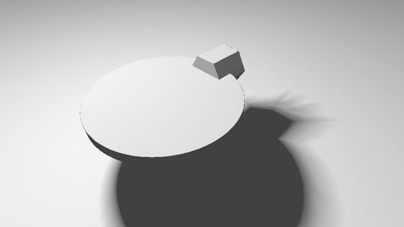
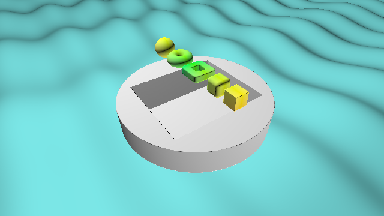
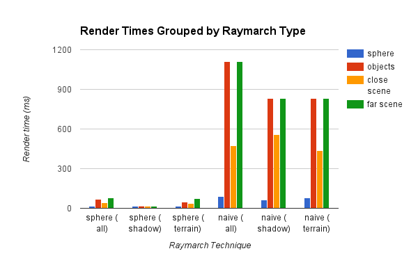
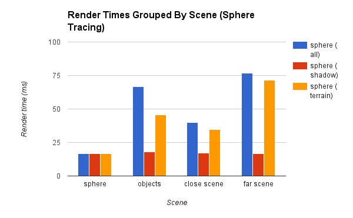

# [CIS565 2015F] Shadertoy: Morph

**GLSL Ray Marching**

**University of Pennsylvania, CIS 565: GPU Programming and Architecture, Project 5**

Terry Sun; Google Chrome 45.0, Arch Linux, Intel i5-4670, GTX 750

A ray-marching shader implemented as a fragment shader. For each pixel, a ray is
shot from the camera into the scene. Rather than computing geometry
_intersections_ (as would be typical in a raytracer), this "marches" along the
ray and, at each point, computes the distances away from objects defined in the
scene. Objects are defined implicitly with signed data functions.

### [Live on Shadertoy!][shadertoy]

The Shadertoy demo includes a large set of debug flags, where you can turn on:

* `SCENE1/SCENE2`: SCENE2 contains the image below; SCENE1 contains the geometry demo
* `PLANE/HEIGHTMAP`: enable or disable the (distance function-defined) plane below
  the scene or the height-mapped terrain (the two options toggled independently)
* `FIXEDCAM`: the camera rotates around the scene if 0
* `OVERRELAX/SPEHRETRACE/NAIVE`: for different raymarching types
* `DISTANCE/NORMAL/ITERS`: for different debug displays

[][shadertoy]

  [shadertoy]: https://www.shadertoy.com/view/XISSRc

### Acknowledgements

This Shadertoy project uses *code* from the following resources:

* Morgan McGuire's
  *Numerical Methods for Ray Tracing Implicitly Defined Surfaces*.
  [PDF][mcguire]
* Iñigo Quílez's [Modeling with distance functions][iq-sdf]: [Shadertoy][iq-sdf-st]
* Iñigo Quílez's [Terrain Raymarching][iq-terrain]
* Iñigo Quílez's [Free Penumbra Shadows for Raymarching Distance Fields][iq-shadows]
  (Soft shadows)
* Iñigo Quílez's [Menger fractal][menger]

  [mcguire]: http://graphics.cs.williams.edu/courses/cs371/f14/reading/implicit.pdf
  [iq-sdf]: http://www.iquilezles.org/www/articles/distfunctions/distfunctions.htm
  [iq-sdf-st]: https://www.shadertoy.com/view/Xds3zN
  [iq-terrain]: http://www.iquilezles.org/www/articles/terrainmarching/terrainmarching.htm
  [iq-shadows]: http://www.iquilezles.org/www/articles/rmshadows/rmshadows.htm
  [iq-menger]: http://www.iquilezles.org/www/articles/menger/menger.htm

And uses the following as resources only:

* "Enhanced Sphere Tracing." Keinert, Schafer, Korndorf, Ganse, Stamminger.
  [PDF][keinert]

  [keinert]: http://erleuchtet.org/~cupe/permanent/enhanced_sphere_tracing.pdf

### Features

#### Technique

1. From the camera, shoot a ray into the scene. Then...

  1. Naive raymarch: for every *fixed-size* step along a ray, compute the
     distance away from all objects in the scene. An object is considered
     intersected if it is below some small threshold.

  2. Sphere tracing raymarch: at any given point along a ray, you have computed the
     minimum distance *d* from objects in the scene in order to check for
     intersections. Thus, if *d* doesn't indicate an intersection, it is safe to
     take a step of length *d* along the ray.

3. Terrain: If you have traveled some capped maximum distance away from the
   camera, consider the ray as not intersecting the scene. However, there is
   terrain!  Continue the same raymarch, but compute terrain height rather than
   object distances. This must be a naive raymarch.

4. Shadows: Once the ray has intersected an object or terrain, initiate (yet
   another) raymarch from the point of intersection to the light. This will
   determine the shadowing factor at that point.

5. Lighting: Put the above together (intersection point, shadow factor) with a
   simple normal calculation for simple Lambert lighting.

#### Objects

Rererence:
McGuire ["Implicitly Defined Surfaces"][mcguire],
iq ["Modeling with distance functions"][iq-sdf],
iq ["Menger fractal"][iq-menger]

Geometries are defined implicitly with signed distance functions, mostly taken
verbatim out of iq's references. Objects are composed with union and
intersection functions.

#### Soft Shadows

Reference: iq ["Modeling with distance functions"][iq-sdf], iq ["Free Penumbra Shadows for Raymarching Distance Fields"][iq-shadows]

Compute a second raymarch from the intersection point to the light. Take the
minimum over all points along the raymarch of the intersection distance against
all objects in the scene. This yields soft shadows: even without a direct
intersection, things that come _close_ to intersection result in shadows.

#### Height Mapped Terrain

Reference: iq ["Terrain Raymarching"][iq-terrain]

If a ray does not collide with any scene geometry after a max distance from the
camera, instead compute an intersection with a terrain function. The terrain
is defined with a function that takes an (x, z) pair and computes the height at
that location.

For this raymarch we must use a naive method (with fixed step size), since the
function does not compute a distance from a point on the ray to the terrain (it
only defines the terrain height at a given point).

#### Sphere Overrelaxation

Reference: McQuire ["Implicitly Defined Surfaces"][mcguire], Keinert ["Enhanced Sphere Tracing"][keinert]

The number of ray march iterations displayed as grayscale, with darker areas
indicating fewer iterations before the surface is considered intersected.

(This method is not currently working.)

### Performance

Render times for different scenes grouped by raymarch type:

Easy to see why naive raymarching is not done.

And the transpose, with only sphere tracing times:

Main takeaways:

* Scenes where most of the rays intersect (early) are fast.

* Terrain is very slow, because all rays which hit terrain did not
  intersect and had to complete a full raymarch, and _additionally_ had to go
  through a second _naive_ raymarch.

* Shadows have a small effect. The shadow timing is really the difference
  between the all-scene and terrain-only scene. Reasonable: shadows should
  involve a (relatively short) raymarch capped at distance from intersection to
  light.

* stats.js wasn't great for finding timing data: all of the shadow-only timings
  are actually bound by the 60fps cap.

* There sphere scene was similar to the close scene in composition, but had only
  one object rather than many. The difference in time between those two are
  likely due ot repeated distance function computations.

Since there's no use in directly comparing sphere-traced and naive times, this
is a graph that scales render times by the full version of that raymarch type:

### Bonus images

Raw position data, with the sphere at (0, 0, 0) and a plane underneath.

Normals for each geometry, computed with the equation given in McGuire (8).

Naive ray marching with a step size of 0.1 (too large), got wireframes instead
of solid shapes:

Overrelaxation without backwards step, resulting in stepping into the middle of
the geometries (and gloopiness):

