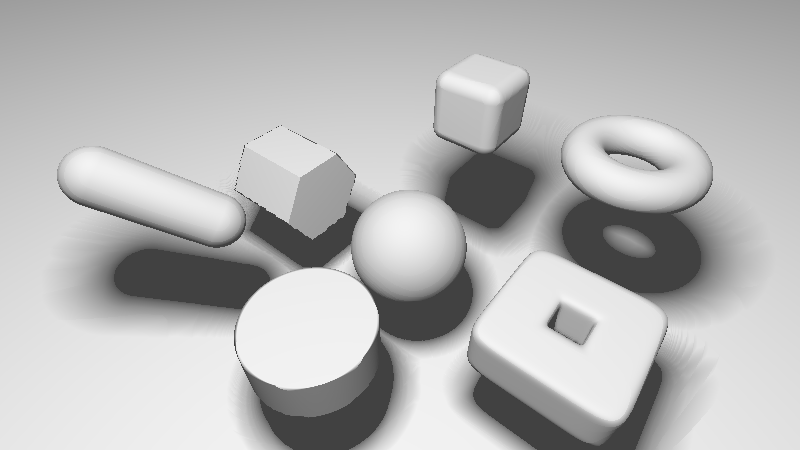
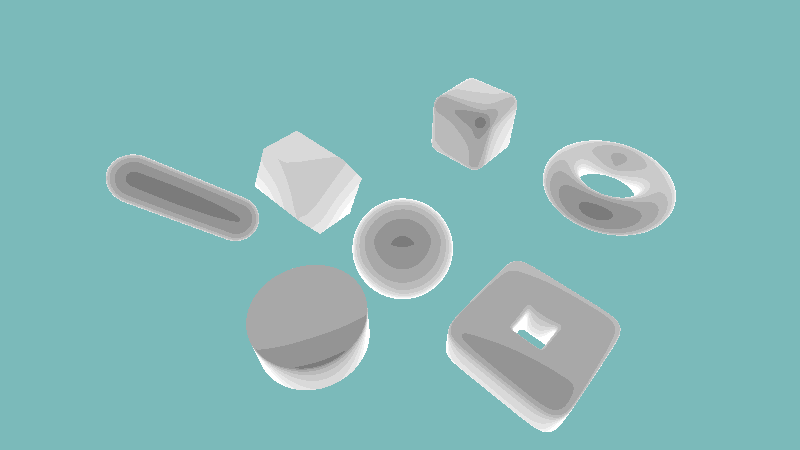
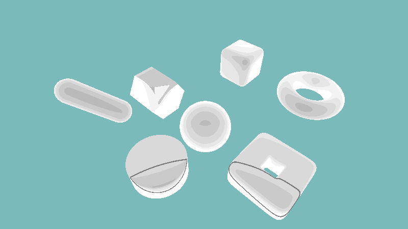
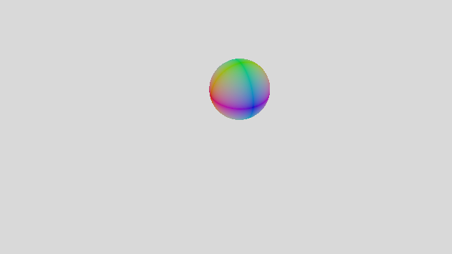
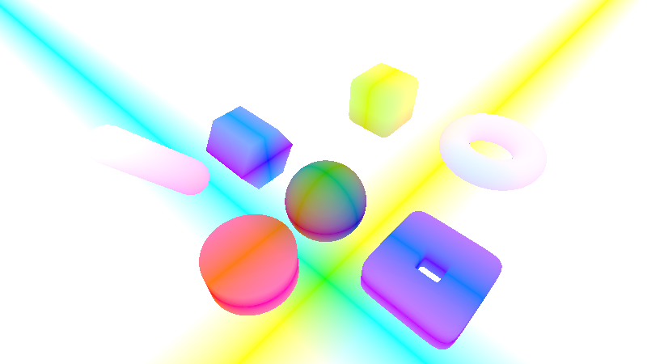
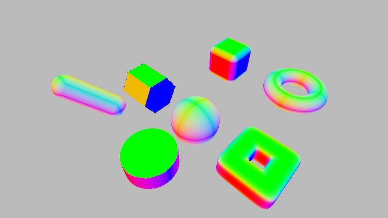
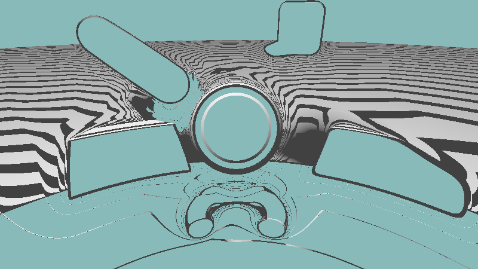
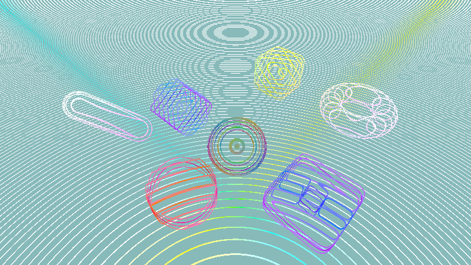

# [CIS565 2015F] Shadertoy

**GLSL Ray Marching**

**University of Pennsylvania, CIS 565: GPU Programming and Architecture, Project 5**

Terry Sun; Google Chrome 45.0, Arch Linux, Intel i5-4670, GTX 750

### Live on Shadertoy (TODO)

### Acknowledgements

This Shadertoy uses *code* from the following resources:

* Morgan McGuire's
  *Numerical Methods for Ray Tracing Implicitly Defined Surfaces*.
  [PDF](http://graphics.cs.williams.edu/courses/cs371/f14/reading/implicit.pdf)
* Iñigo Quílez's [Modeling with distance functions]
  (http://www.iquilezles.org/www/articles/distfunctions/distfunctions.htm) --
  [Shadertoy] (https://www.shadertoy.com/view/Xds3zN)
* "Enhanced Sphere Tracing." Keinert, Schafer, Korndorf, Ganse, Stamminger.
  [PDF](http://erleuchtet.org/~cupe/permanent/enhanced_sphere_tracing.pdf)

### Features

#### Geometries

Rererence: iq "Raymarching Primitives", McQuire "Implicitly Defined Surfaces"

#### Soft Shadows

Rererence: iq "Modeling with distance functions"

#### Sphere Overrelaxation

Reference: McQuire "Implicitly Defined Surfaces", "Enhanced Sphere Tracing"

Iteration difference:

### Debug images

Initial sphere

Positions

Normals

### Bloopers

Overrelaxation without stepping backwards:

Accidentally broke naive raymarching and got wireframes (position colors):

