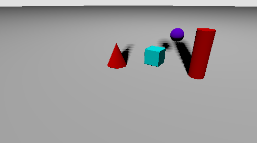
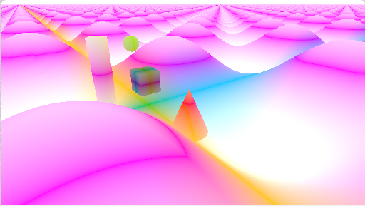
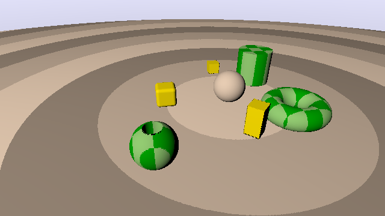

# [CIS565 2015F] GLSL Ray Marching

**University of Pennsylvania, CIS 565: GPU Programming and Architecture, Project 5**

* Sally Kong
* Tested on: Google Chrome 46, Macbook Air 2014, 1.4 GHz Intel Core i5, ntel HD Graphics 5000 1536 MB (Personal)

### Live on Shadertoy 

### Acknowledgements
This Shadertoy uses material from the following resources:

* {McGuire}
  Morgan McGuire, Williams College.
  *Numerical Methods for Ray Tracing Implicitly Defined Surfaces* (2014).
  [PDF](http://graphics.cs.williams.edu/courses/cs371/f14/reading/implicit.pdf)
  * You may credit and use code from this reference.
* {iq-prim}
  Iñigo Quílez.
  *Raymarching Primitives* (2013).
  [Shadertoy](https://www.shadertoy.com/view/Xds3zN)
* {iq-terr}
  Iñigo Quílez.
  *Terrain Raymarching* (2007).
  [Article](http://www.iquilezles.org/www/articles/terrainmarching/terrainmarching.htm)
  * You may credit and use code from this reference.

### Features

* Two ray marching methods (comparative analysis required)
  * Naive ray marching (fixed step size) {McGuire 4}
  * Sphere tracing (step size varies based on signed distance field) {McGuire 6}
* 3 different distance estimators {McGuire 7}
  * With normal computation {McGuire 8}
* Lambert shading
* Soft shadowing 
* Union operator {McGuire 11.1}
* Transformation operator {McGuire 11.5}
* Debug views
  * Distance to surface for each pixel
  * Number of ray march iterations used for each pixel
* Height-mapped terrain rendering 

### Images

  

