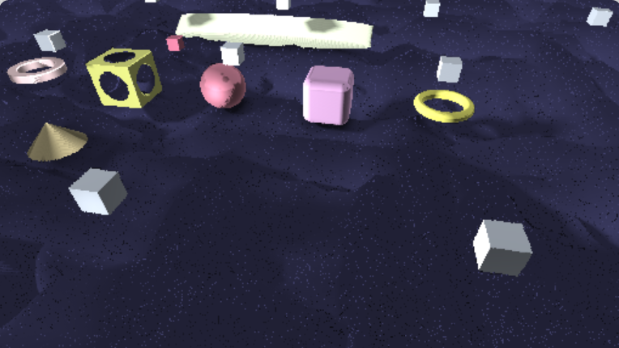
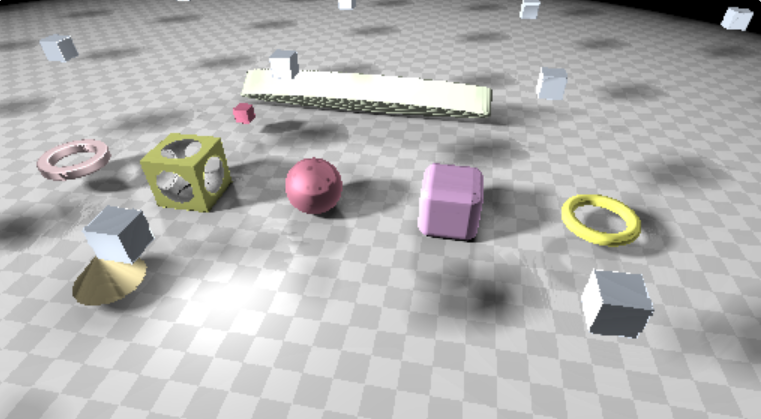
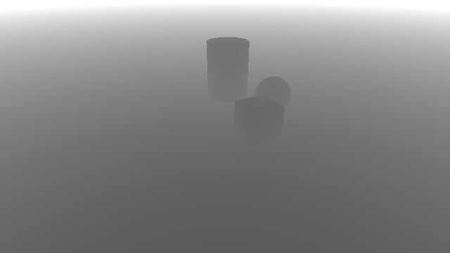
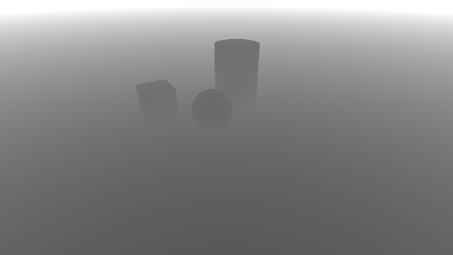
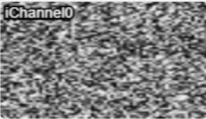
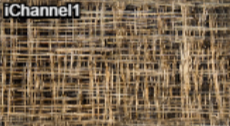
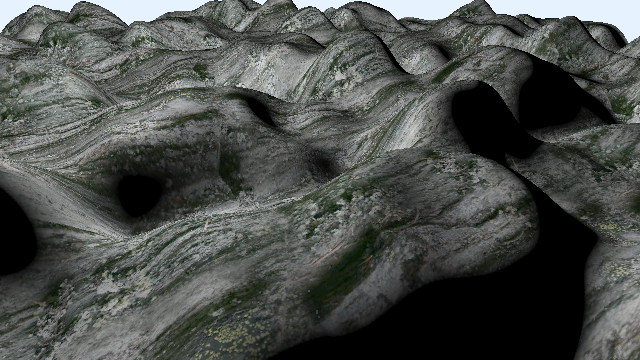
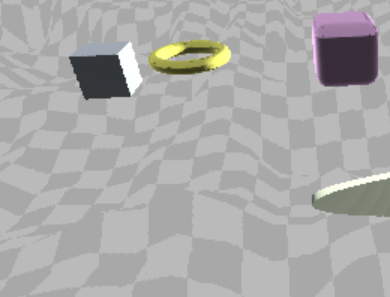
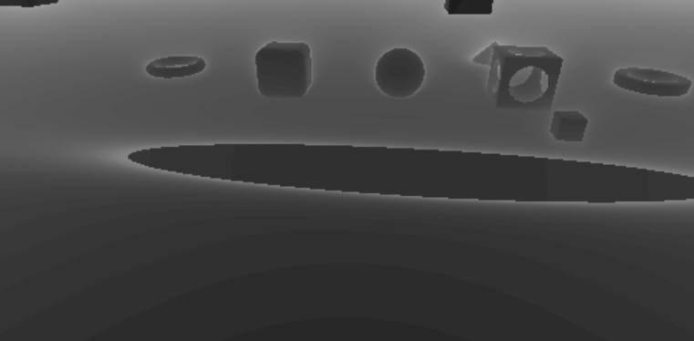

# [CIS565 2015F] YOUR TITLE HERE

**GLSL Ray Marching**

**University of Pennsylvania, CIS 565: GPU Programming and Architecture, Project 5**

* xinyue Zhu
* Tested on: Chrome - Version 45.0.2454.93 m
  Windows 10, i5-5200U @ 2.20GHz 8.0GB, GTX 960M 

### Live on Shadertoy (TODO)

### Acknowledgements

This Shadertoy uses material from the following resources:

iq Cloudy Terrain:

https://www.shadertoy.com/view/MdlGW7

iq RayMarching Primitives:

https://www.shadertoy.com/view/Xds3zN

Numerical Methods for Ray Tracing Implicitly Defined Surfaces:

http://graphics.cs.williams.edu/courses/cs371/f14/reading/implicit.pdf

others:

http://www.iquilezles.org/www/articles/distfunctions/distfunctions.htm

### ReadMe
note: to use "#define terrMap" the "#define naive" should be used at the same time 

**Features:**
* Two ray marching methods: 
  * Naive ray marching :#define naive
  * Sphere tracing
* different distance estimators & operation
  * Box,wheel,roundBox,plane,cone,Torus,cylinder
  * operation: subtraction,repeat
  * With normal computation 
* One simple lighting computatio: Blinn-Phong.
* Union operator :float opU(...){}
* Transformation operator: float opTrans(..){}
* Lighting effects
  *  Soft shadowing using secondary rays {iq-prim} {iq-rwwtt p55}
  *  Ambient occlusion  {iq-prim}

* Debug views 
  * Distance to surface for each pixel: #define debugView1
  * Number of ray march iterations used for each pixel:  #define debugView2

  

* Advanced distance estimators
  *  Height-mapped terrain rendering: (texture base) 

### Analysis

* Provide an analysis comparing naive ray marching with sphere tracing
   
naive ray marching: 5.6fps;

   
accelated ray marching : 60.1fps;

  * the "most expensive" fragments by number of iterations required for each pixel.
  

  the first one is using naive ray marching, the whiter the number of iteration is bigger. the shadow I calculate using 
the fixed footstep, so it iterates much. The naive ray marching is much more "expensive"

* Compare time spent ray marching vs. time spent shading/lighting: 

     | First Header  | Second Header |
     | ------------- | ------------- |
     | Content Cell  | Content Cell  |
     | Content Cell  | Content Cell  |

  
|raymarching with terrain  |8 FPS          |132ms|

  
|raymarching without terr  |49.2FPS  ||

  
|ray marching without terr & AO: 50.1 FPS

  
|ray marching without terr & AO & shadow: 60.0 FPS

   
  * This can be done by taking measurements with different parts of your code
    enabled (e.g. raymarching, raymarching+shadow, raymarching+shadow+AO).
  * Plot this analysis using pie charts or a 100% stacked bar chart.
* For each feature (required or extra), estimate whether branch divergence
  plays a role in its performance characteristics, and, if so, point out the
  branch in question.
  (Like in CUDA, if threads diverge within a warp, performance takes a hit.)
* For each optimization feature, compare performance with and without the
  optimization. Describe and demo the types of scenes which benefit from the
  optimization.

### Resources

You **must** acknowledge any resources you use, including, but not limited to,
the links below. **Do not copy non-trivial code verbatim.** Instead, use the
references to understand the methods.

For any code/material in the 565
[slides](http://cis565-fall-2015.github.io/lectures/12-Ray-Marching.pptx),
please reference the source found at the bottom of the slide.

* {McGuire}
  Morgan McGuire, Williams College.
  *Numerical Methods for Ray Tracing Implicitly Defined Surfaces* (2014).
  [PDF](http://graphics.cs.williams.edu/courses/cs371/f14/reading/implicit.pdf)
  * You may credit and use code from this reference.
* {iq-prim}
  Iñigo Quílez.
  *Raymarching Primitives* (2013).
  [Shadertoy](https://www.shadertoy.com/view/Xds3zN)
* {iq-terr}
  Iñigo Quílez.
  *Terrain Raymarching* (2007).
  [Article](http://www.iquilezles.org/www/articles/terrainmarching/terrainmarching.htm)
  * You may credit and use code from this reference.
* {iq-rwwtt}
  Iñigo Quílez.
  *Rendering Worlds with Two Triangles with raytracing on the GPU* (2008).
  [Slides](http://www.iquilezles.org/www/material/nvscene2008/rwwtt.pdf)
* {Ashima}
  Ashima Arts, Ian McEwan, Stefan Gustavson.
  *webgl-noise*.
  [GitHub](https://github.com/ashima/webgl-noise)
  * You may use this code under the MIT-expat license.

## Submit

### Post on Shadertoy

Post your shader on Shadertoy (preferably *public*; *draft* will not work).
For your title, come up with your own demo title and use the format
`[CIS565 2015F] YOUR TITLE HERE` (also add this to the top of your README).

In the Shadertoy description, include the following:

* A link to your GitHub repository with the Shadertoy code.
* **IMPORTANT:** A copy of the *Acknowledgements* section from above.
  * Remember, this is public - strangers will want to know where you got your
    material.

Add a screenshot of your result to `img/thumb.png`
(right click rendering -> Save Image As), and put the link to your
Shadertoy at the top of your README.

### Pull Request

**Even though your code is on Shadertoy, make sure it is also on GitHub!**

1. Open a GitHub pull request so that we can see that you have finished.
   The title should be "Submission: YOUR NAME".
   * **ADDITIONALLY:**
     In the body of the pull request, include a link to your repository.
2. Send an email to the TA (gmail: kainino1+cis565@) with:
   * **Subject**: in the form of `[CIS565] Project N: PENNKEY`.
   * Direct link to your pull request on GitHub.
   * Estimate the amount of time you spent on the project.
   * If there were any outstanding problems, or if you did any extra
     work, *briefly* explain.
   * Feedback on the project itself, if any.
