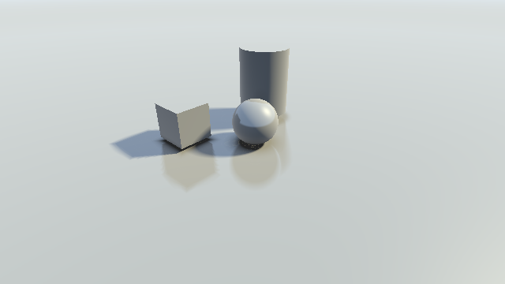
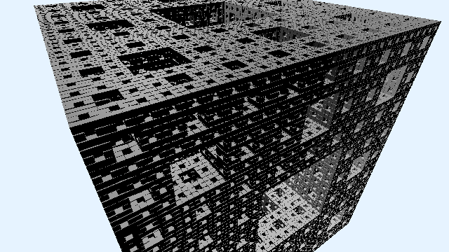
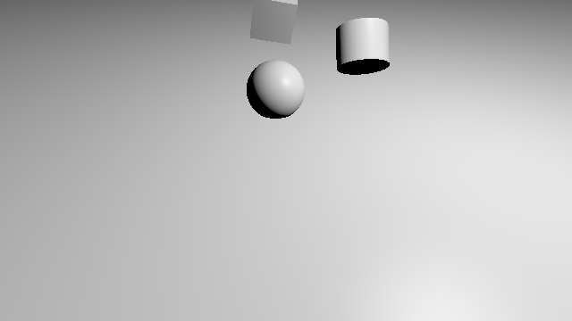
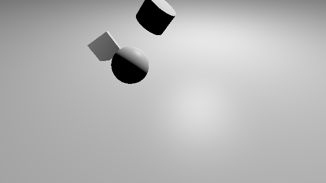
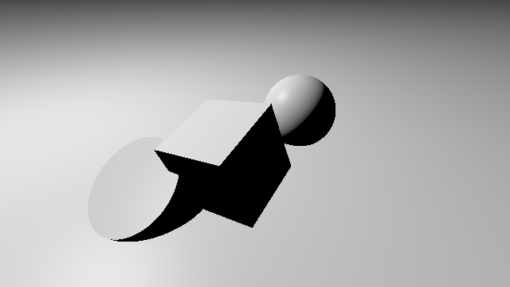

# [CIS565 2015F] YOUR TITLE HERE

**GLSL Ray Marching**

**University of Pennsylvania, CIS 565: GPU Programming and Architecture, Project 5**

siqi Huang Tested on: Windows 7, Inter(R) Core(TM) i7-4870 HQ CPU@ 2.5GHz; GeForce GT 750M(GK107) (Personal Computer)

Representative Images:

PART O: Operations
#define mode
case 1: Smart Ray Casting
case 2: Naive Ray Casting
case 3: Height Map
case 4: Fractals
case 5: Ambient Occlusion and Soft Shadows
case 6: Debug View

PART I: Different Ray Marching Methods

Sphere:

The sphere method is pretty simple, compute the distance from the ray to the center of the sphere. Normal is easy to get too.

Cube:

The cube is a little difficult than the sphere. You have to decide which direction goes to the boundary first, which means which is the biggest among xyz in absolute value. Then the normal has only 6 values.

Cylinder:

The cylinder is the combination of cube and sphere. in y direction, compute like cube, in xz direction compute like sphere.

PART II: Naive Ray Marching vs Smart Ray Marching

In naive ray marching, the move step is fixed. So the time used in linear to the iteration number.
In smart ray marching, the move step is dynamic, based on the distance to the nearest object. So the time is constant.
However, the smart time cannot do feature like height map and fractal which is talked below, naive can do both.
The performance analysis is in the last part.

PART III: Lambert and Blinn-phong Effect
When we get the distance to the object and the normal, we get the intersection point. Given the ray position and light position, using what we have done in previous GPU projects, it is easy to get all those effects.

PART IV: Object Transformation
To transform an object, we can size it up, move it and rotate it. All those all defined using matrix multiplication. After the transformation, we need to transform both the ray position and direction to the object coordinate. So we get the following results:

The images here has the lighting effects, but have no ambient occlusion and soft shadows. I have tried to apply those to them but failed. Because the ambient occlusion and soft shadows need to specify fixed position of objects without movement, which is not possible for transformation, so I split them as separate demonstration here. 
