# [CIS565 2015F] YOUR TITLE HERE

**GLSL Ray Marching**

**University of Pennsylvania, CIS 565: GPU Programming and Architecture, Project 5**

* Ziwei Zong
* Tested on: (TODO) **Google Chrome 222.2** on
  Windows 10, i7-5500 @ 2.40GHz 8GB, GTX 950M (Personal)

Overview
========================

[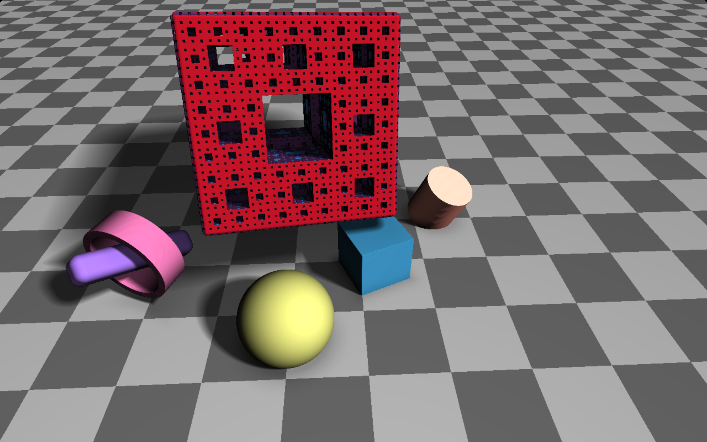](https://www.shadertoy.com/view/4tjSRK)
[Shadertoy Live Here !](https://www.shadertoy.com/view/4tjSRK)

|

Acknolegements
========================

**Iñigo Quílez**

* Raymarching Primitives. [Shadertoy](https://www.shadertoy.com/view/Xds3zN)

* Menger Sponge.  [Shadertoy](https://www.shadertoy.com/view/4sX3Rn)

Features
========================

**Height Map**

|Terrain with texture				|Normal
|:---------------------------------:|:---------------------------------------:
|	|
|Distance Debug View			|Iteration Number Debug View
|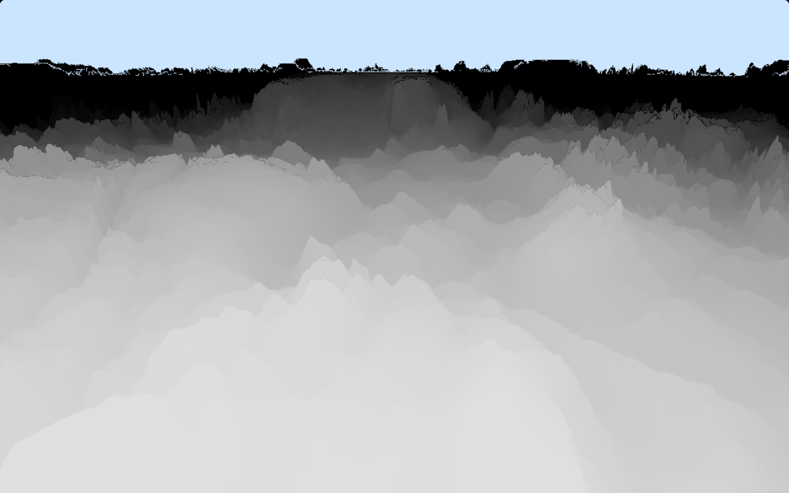	|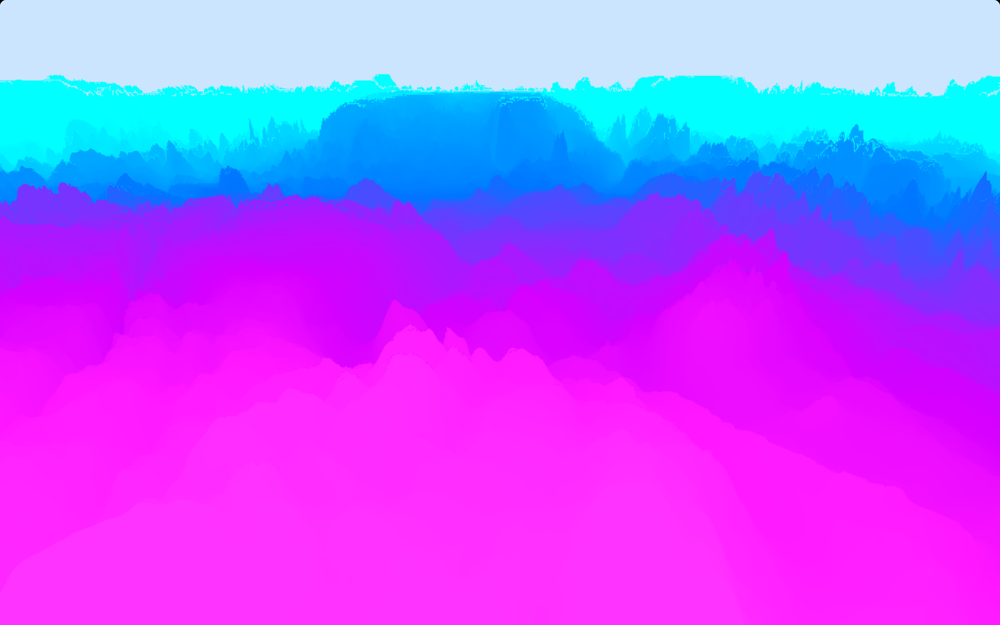

*Purple means less iteration and blue means more.

**Merger Sponge**

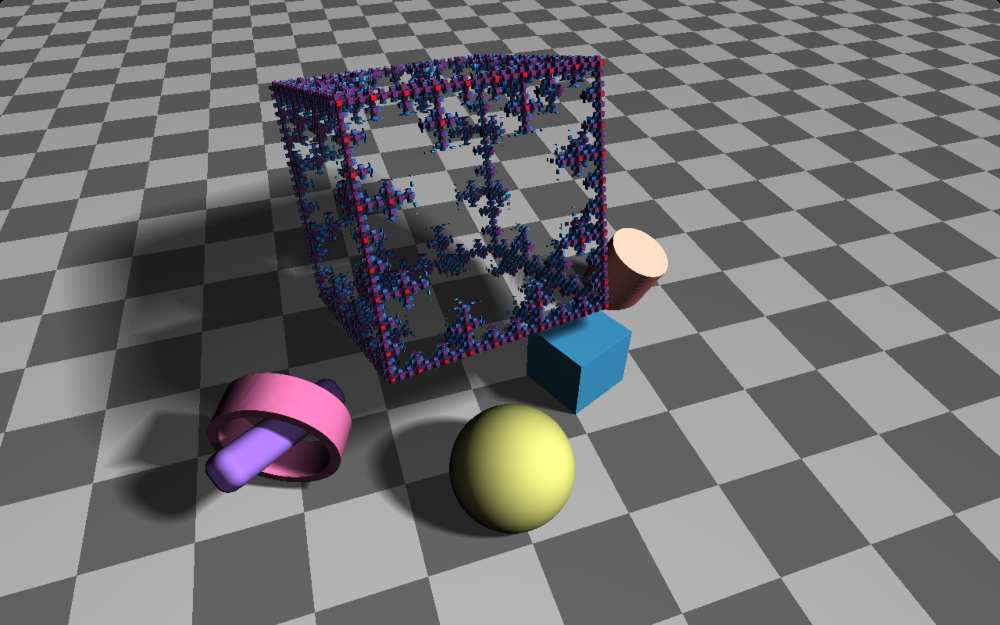

A fun thing about merger sponge is that by simply changing the threshold with time, there would be
an interesting erosion effect, as shown above.

**Soft Shadow**

|Soft Shadow				|Sharp Shadow
|:---------------------------------:|:---------------------------------------:
|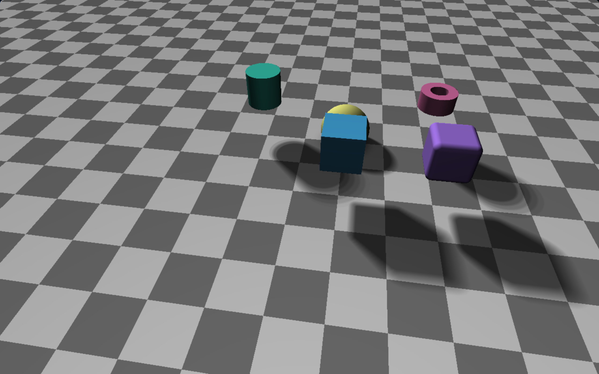	|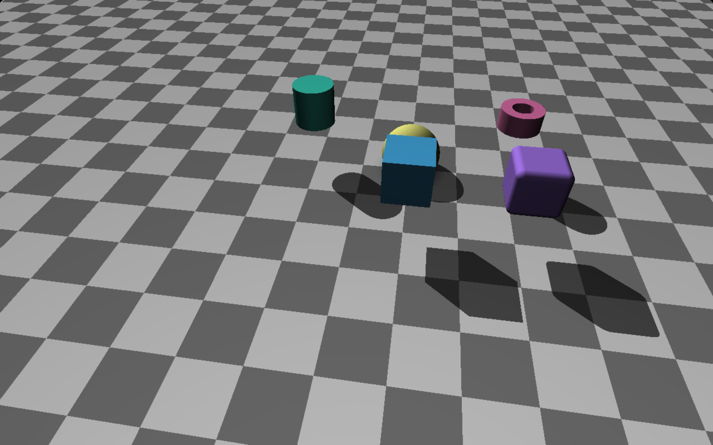

**Ambient Occlusion**

|Without AO				|With AO
|:---------------------------------:|:---------------------------------------:
|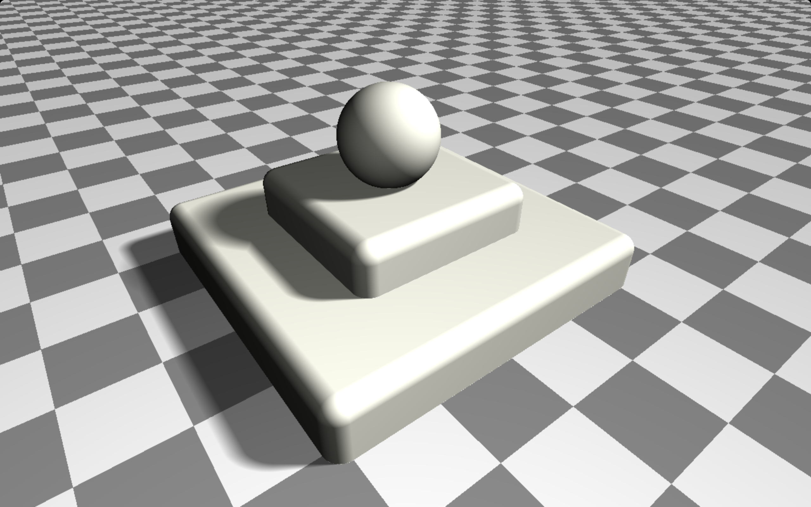	|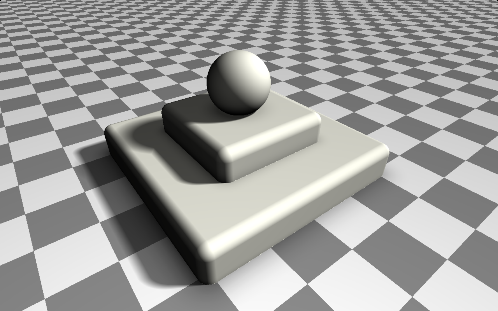

Analysis
========================

#### Naive Ray Marching vs. Sphere Tracing

**Test Scene**

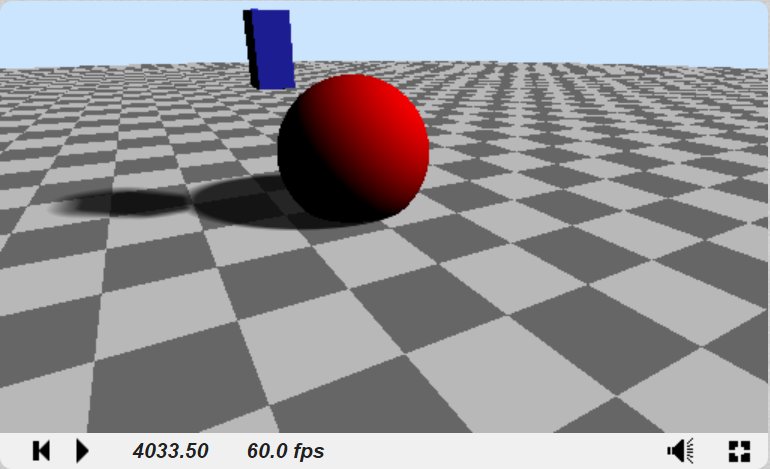

**Iteration Number Debug View**

|Naive Ray Marching					|Sphere Tracing
|:---------------------------------:|:---------------------------------------:
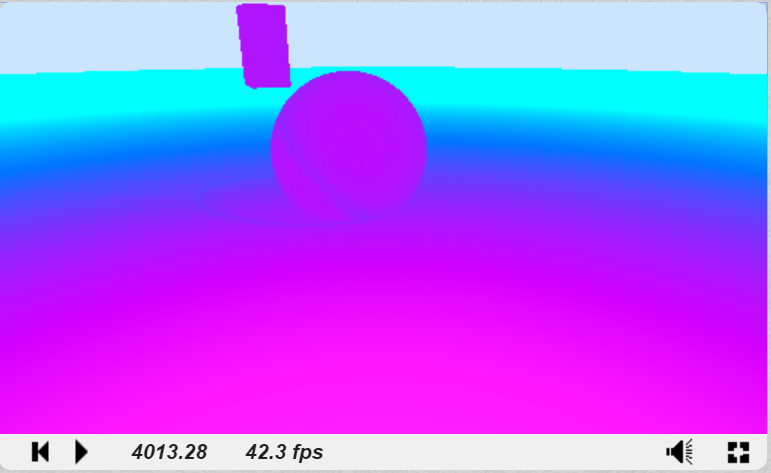||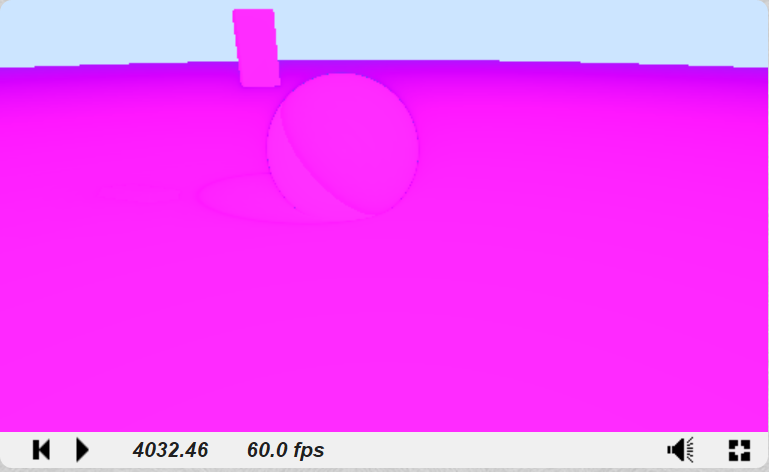	

*Purple means less iteration and blue means more.

**Precision and FPS**

* Naive Ray Marching

|Max Iteration Number| 1000| 1300| 2000| 4000|19000|
|--------------------|-----|-----|-----|-----|-----|
|		Precision	 |0.02 |0.015| 0.01|0.005|0.001|
|   FPS				 |   60|   52|   38|   20|  4.3|

* Sphere Tracing

|Max Iteration Number|80000 |        |        |        |
|--------------------|------|--------|--------|--------|
|		Precision	 |  1e-6|  9.5e-7|  9.0e-7|  6.0e-7|
|   FPS				 |    60|    12.5|       7|     6.8|

As shown in the table, the FPS of naive ray marching drops off significantly due to the precision. 
A smaller the precision threshold means more iteration number and thus takes more time.
However on the contrary, the sphere tracing method is not very sensitive to the precision.

#### Time Spent

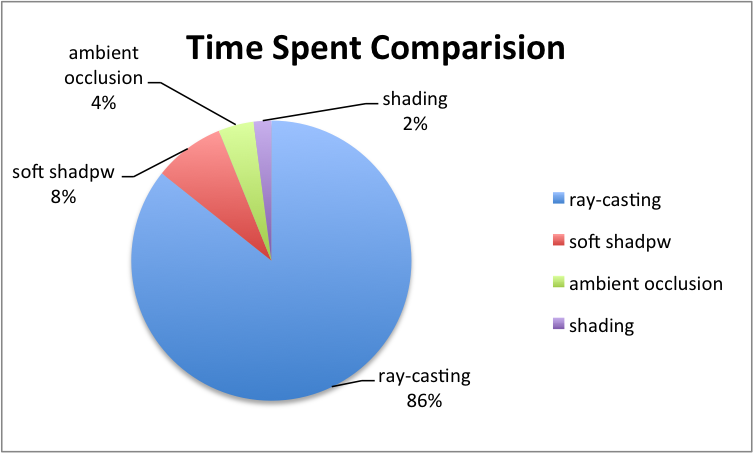	

As expected, the ray-casting step takes the longest time because all the iterations and interactions with objects are in this step. 
Same for the shadowing, since there are some iteration towards the light for each objects, it takes relatively longer time for shadowing than shading and ambient occlusion.
