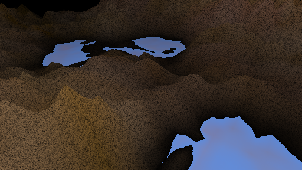
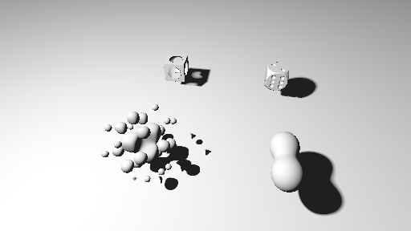
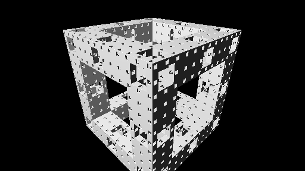
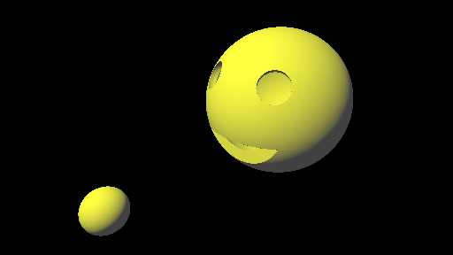
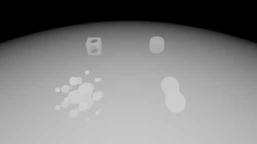
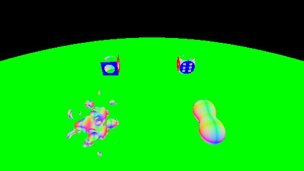
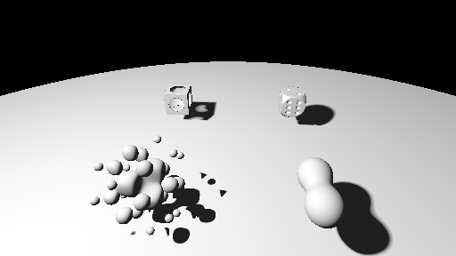
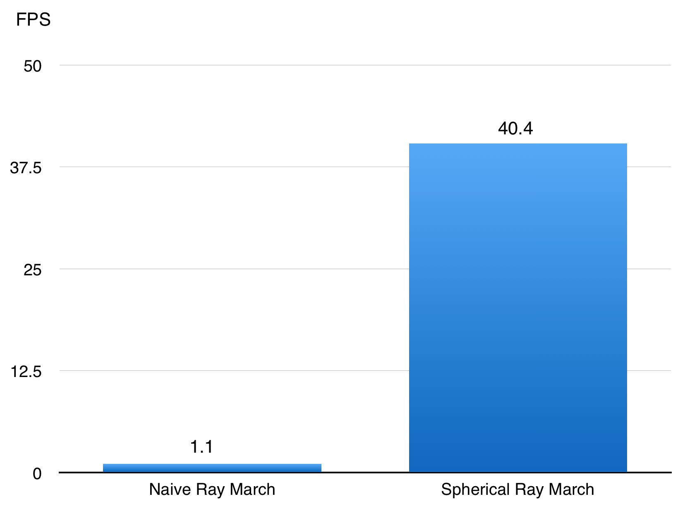
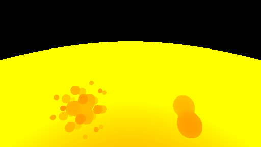
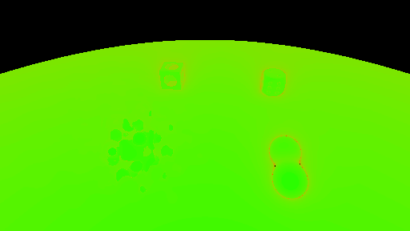

# [CIS565 2015F] A Badly named Awesome Ray Marcher

**GLSL Ray Marching**

**University of Pennsylvania, CIS 565: GPU Programming and Architecture, Project 5**

* SANCHIT GARG
* Tested on: Google Chrome Version 45.0.2454.101 (64-bit) on
* 	Mac OSX 10.10.4, i7 @ 2.4 GHz, GT 650M 1GB (Personal Computer)

### Live on Shadertoy

         

### Acknowledgements

* {McGuire}
  Morgan McGuire, Williams College.
  *Numerical Methods for Ray Tracing Implicitly Defined Surfaces* (2014).
  [PDF](http://graphics.cs.williams.edu/courses/cs371/f14/reading/implicit.pdf)
* {iq-prim}
  Iñigo Quílez.
  *Raymarching Primitives* (2013).
  [Shadertoy](https://www.shadertoy.com/view/Xds3zN)
* {iq-terr}
  Iñigo Quílez.
  *Terrain Raymarching* (2007).
  [Article](http://www.iquilezles.org/www/articles/terrainmarching/terrainmarching.htm)
* {iq-rwwtt}
  Iñigo Quílez.
  *Rendering Worlds with Two Triangles with raytracing on the GPU* (2008).
  [Slides](http://www.iquilezles.org/www/material/nvscene2008/rwwtt.pdf)
* {Ashima}
  Ashima Arts, Ian McEwan, Stefan Gustavson.
  *webgl-noise*.
  [GitHub](https://github.com/ashima/webgl-noise)

  

### What is a Ray Marcher

Ray marching is an image based volume rendering technique. With ray marching, you can compute 2D images from 3D volumetric data. For the data, I used implicit surface definitions using signed distance functions as explained in [PDF](http://graphics.cs.williams.edu/courses/cs371/f14/reading/implicit.pdf).

### Features

The main features implemented include :

* Signed Distance functions for different geometries
* Naive Ray March
* Spherical Ray March
* Normal Computations
* Lambert Shading
* Soft Shadow
* Union Operation 
* Difference Operation 
* Intersection Operation 
* Blend Operation 
* Displacement Operation
* Transformation Operation
* Fractals
* Terrain Mapping
* Debug views for Distance, Step Count, Lambert, Normals
* Infinite Terrains

### Performance Analysis

##### Debug Views:

* Depth View : The color goes from white to black (white being closer to the camera)

* Normals View

##### Comparison between Naive and Spherical Ray March

In a naive ray marcher, we take fixed jumps to get to the primitive. In a spherical ray march, we find the surface that is closest to the current point. Then we take the jump of that amount. This becomes extremely fast as the jumps every step are bigger. This can be easily seen from the FPS of the 2 approaches. The analysis is done for the following image 

The bar graph for FPS rates are :

* Steps View : The color goes from green to red to yellow (green being the minimum number of steps)

