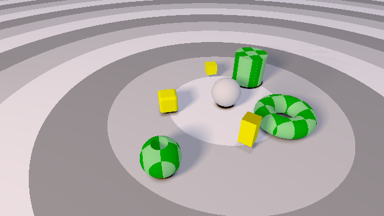
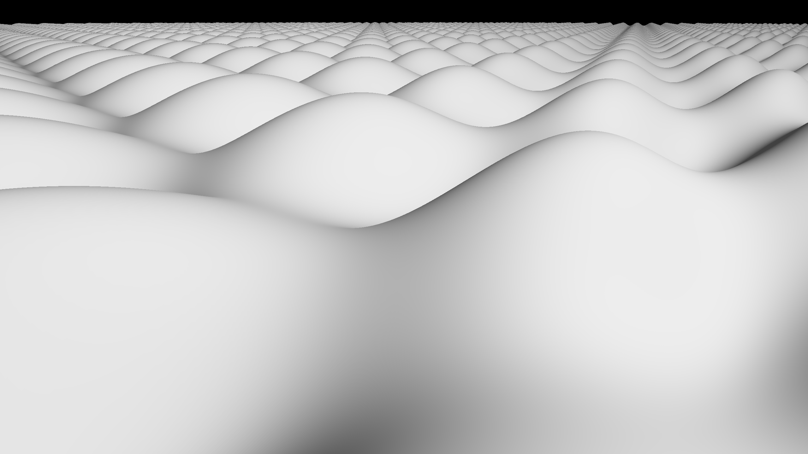
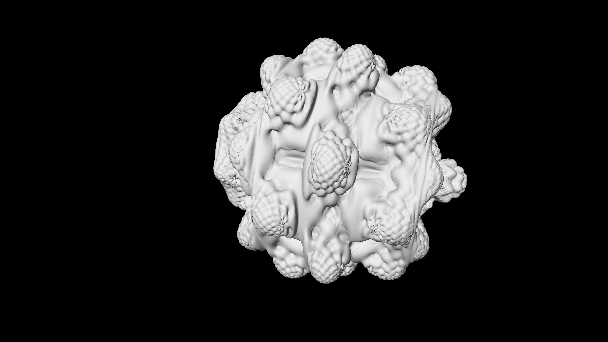
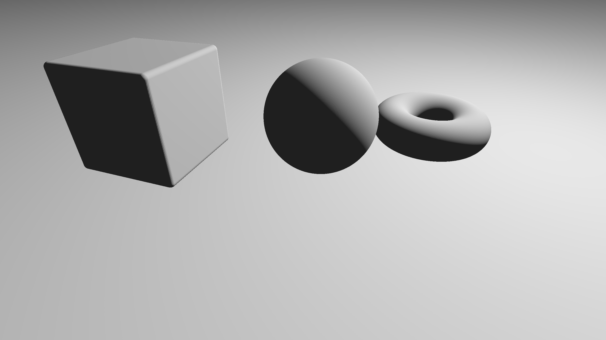
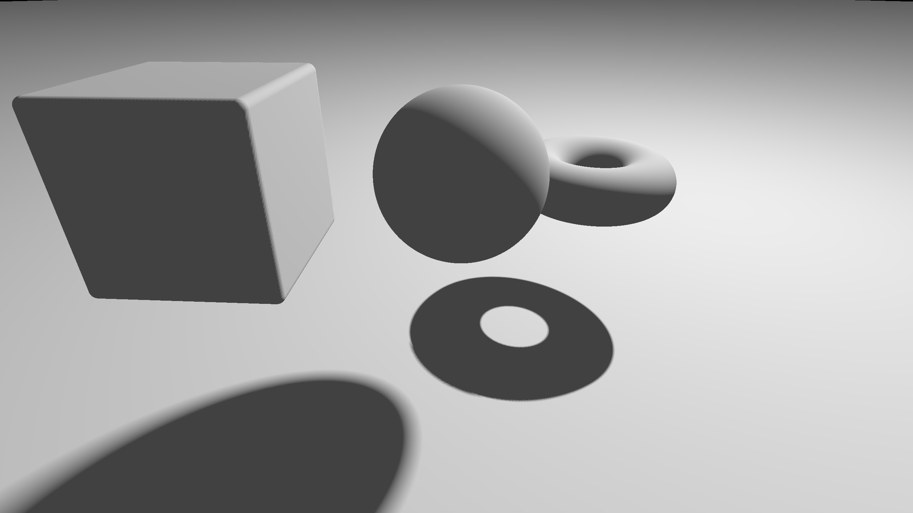

# GLSL Ray Marching

**University of Pennsylvania, CIS 565: GPU Programming and Architecture, Project 5**

* Bradley Crusco
* Tested on: Google Chrome 46 on Windows 10, i7-3770K @ 3.50GHz 16GB, 2 x GTX 980 4096MB (Personal Computer)

### Live on Shadertoy (TODO)

## Description

TODO

## Features

### Naive Ray Marching

Ray marching with a fixed step size. Refer to the analysis section for more information on this method.

### Sphere Tracing

Ray marching using a variable step size based on a signed distance field. Refer to the analysis section for more information on this method.

### Distance Estimators
Distance estimators are used to define the objects in our scene. Support for the following basic distance estimators is provided:
* Sphere {[McGuire 7.1](http://graphics.cs.williams.edu/courses/cs371/f14/reading/implicit.pdf)}
* Plane {[McGuire 7.2](http://graphics.cs.williams.edu/courses/cs371/f14/reading/implicit.pdf)}
* Box {[McGuire 7.3](http://graphics.cs.williams.edu/courses/cs371/f14/reading/implicit.pdf)}
* Rounded Box {[McGuire 7.4](http://graphics.cs.williams.edu/courses/cs371/f14/reading/implicit.pdf)}
* Torus {[McGuire 7.5](http://graphics.cs.williams.edu/courses/cs371/f14/reading/implicit.pdf)}

### Height-Mapped Terrain Distance Estimator

### Fractal Distance Estimator

### Lambert Lighting Computation
A simple Lambert lighting computation was used for rendering. Below is an example render using the Lambert computation without soft shadows.

#### Lambert Lighting Image (No Soft Shadows)

### Soft Shadows
Soft shadows are added by completing a second ray march to the light, and scaling the shadow by the ratio of the change in distance and the total distance on each iteration of the march.

#### Lambert Lighting Image (Soft Shadows)

### Distance Operators

Distance estimators are used to define the objects in our scene. Support for the following basic distance estimators is provided:
Distance operators are used to add, remove, and combine basic shapes from the distance estimators into a full, complex scene. Support for the following distance operators is provided:

* Union {[McGuire 11.1](http://graphics.cs.williams.edu/courses/cs371/f14/reading/implicit.pdf)}
* Intersection {[McGuire 11.2](http://graphics.cs.williams.edu/courses/cs371/f14/reading/implicit.pdf)}
* Subtraction {[McGuire 11.3](http://graphics.cs.williams.edu/courses/cs371/f14/reading/implicit.pdf)}
* Displacement {[McGuire 11.5](http://graphics.cs.williams.edu/courses/cs371/f14/reading/implicit.pdf)}
* Blending {[McGuire 11.6](http://graphics.cs.williams.edu/courses/cs371/f14/reading/implicit.pdf)}
* Transformation {[McGuire 11.5](http://graphics.cs.williams.edu/courses/cs371/f14/reading/implicit.pdf)}

### Debug Views
There are two debug views provided. The first shows the distance to the surface for each pixel. It can be activated by uncommenting the DISTANCE_COLOR definition in the shader. The second shows the number of ray march iterations used for each pixel. It can be activated by uncommenting the STEP_COUNT_COLOR definition in the shader. Below are examples of both images.

#### Distance Debug Image

#### Step Count Debug Image

## Analysis

### Acknowledgements
* [Morgan McGuire: Numerical Methods for Ray Tracing Implicitly Defined Surfaces](http://graphics.cs.williams.edu/courses/cs371/f14/reading/implicit.pdf)
* [Inigo Quilez: Terrain Raymarching](http://www.iquilezles.org/www/articles/terrainmarching/terrainmarching.htm)

This Shadertoy uses material from the following resources:

* TODO

### (TODO: Your README)

Instructions (delete me)
========================

This is due at midnight on the evening of Monday, October 19.

**Summary:** In this project, you'll see yet another way in which GPU
parallelism and compute-efficiency can be used to render scenes.
You'll write a program in the popular online shader editor
[Shadertoy](http://www.shadertoy.com/).
Your goal will be to implement and show off different features in a cool and
interesting demo. See Shadertoy for inspiration - and get creative!

Ray marching is an iterative ray casting method in which objects are
represented as implicit surfaces defined by signed distance functions (SDFs). This
method is widely used in the Shadertoy community to render complex scenes which
are defined in the fragment shader code executed for each pixel.

**Important Notes:**
* Even though you will be coding in Shadertoy, it is important as always to
  save versions of your code so that you do not lose progress! Commit often!
* A significant portion of this project will be in write-up and performance
  analysis - don't save it for later.

**Provided Code:**
The provided code in `raymarch.glsl` is straight from iq's Raymarching
Primitives; see {iq-prim}. It just sets up a simple starter camera.

### Features

All features must be visible in your final demo for full credit.

**Required Features:**

* Two ray marching methods (comparative analysis required)
  * Naive ray marching (fixed step size) {McGuire 4}
  * Sphere tracing (step size varies based on signed distance field) {McGuire 6}
* 3 different distance estimators {McGuire 7} {iq-prim}
  * With normal computation {McGuire 8}
* One simple lighting computation (e.g. Lambert or Blinn-Phong).
* Union operator {McGuire 11.1}
  * Necessary for rendering multiple objects
* Transformation operator {McGuire 11.5}
* Debug views (preferably easily toggleable, e.g. with `#define`/`#if`)
  * Distance to surface for each pixel
  * Number of ray march iterations used for each pixel

**Extra Features:**

You must do at least 10 points worth of extra features.

* (0.25pt each, up to 1pt) Other basic distance estimators/operations {McGuire 7/11}
* Advanced distance estimators
  * (3pts) Height-mapped terrain rendering {iq-terr}
  * (3pts) Fractal rendering (e.g. Menger sponge or Mandelbulb {McGuire 13.1})
  * **Note** that these require naive ray marching, if there is no definable
    SDF. They may be optimized using bounding spheres (see below).
* Lighting effects
  * (3pts) Soft shadowing using secondary rays {iq-prim} {iq-rwwtt p55}
  * (3pts) Ambient occlusion (see 565 slides for another reference) {iq-prim}
* Optimizations (comparative analysis required!)
  * (3pts) Over-relaxation method of sphere tracing {McGuire 12.1}
  * (2pts) Analytical bounding spheres on objects in the scene {McGuire 12.2/12.3}
  * (1pts) Analytical infinite planes {McGuire 12.3}

This extra feature list is not comprehensive. If you have a particular idea
that you would like to implement, please **contact us first** (preferably on
the mailing list).

## Write-up

For each feature (required or extra), include a screenshot which clearly
shows that feature in action. Briefly describe the feature and mention which
reference(s) you used.

### Analysis

* Provide an analysis comparing naive ray marching with sphere tracing
  * In addition to FPS, implement a debug view which shows the "most expensive"
    fragments by number of iterations required for each pixel. Compare these.
* Compare time spent ray marching vs. time spent shading/lighting
  * This can be done by taking measurements with different parts of your code
    enabled (e.g. raymarching, raymarching+shadow, raymarching+shadow+AO).
  * Plot this analysis using pie charts or a 100% stacked bar chart.
* For each feature (required or extra), estimate whether branch divergence
  plays a role in its performance characteristics, and, if so, point out the
  branch in question.
  (Like in CUDA, if threads diverge within a warp, performance takes a hit.)
* For each optimization feature, compare performance with and without the
  optimization. Describe and demo the types of scenes which benefit from the
  optimization.

**Tips:**

* To avoid computing frame times given FPS, you can use the
  [stats.js bookmarklet](https://github.com/mrdoob/stats.js/#bookmarklet)
  to measure frame times in ms.

### Resources

You **must** acknowledge any resources you use, including, but not limited to,
the links below. **Do not copy non-trivial code verbatim.** Instead, use the
references to understand the methods.

For any code/material in the 565
[slides](http://cis565-fall-2015.github.io/lectures/12-Ray-Marching.pptx),
please reference the source found at the bottom of the slide.

* {McGuire}
  Morgan McGuire, Williams College.
  *Numerical Methods for Ray Tracing Implicitly Defined Surfaces* (2014).
  [PDF](http://graphics.cs.williams.edu/courses/cs371/f14/reading/implicit.pdf)
  * You may credit and use code from this reference.
* {iq-prim}
  Iñigo Quílez.
  *Raymarching Primitives* (2013).
  [Shadertoy](https://www.shadertoy.com/view/Xds3zN)
* {iq-terr}
  Iñigo Quílez.
  *Terrain Raymarching* (2007).
  [Article](http://www.iquilezles.org/www/articles/terrainmarching/terrainmarching.htm)
  * You may credit and use code from this reference.
* {iq-rwwtt}
  Iñigo Quílez.
  *Rendering Worlds with Two Triangles with raytracing on the GPU* (2008).
  [Slides](http://www.iquilezles.org/www/material/nvscene2008/rwwtt.pdf)
* {Ashima}
  Ashima Arts, Ian McEwan, Stefan Gustavson.
  *webgl-noise*.
  [GitHub](https://github.com/ashima/webgl-noise)
  * You may use this code under the MIT-expat license.

## Submit

### Post on Shadertoy

Post your shader on Shadertoy (preferably *public*; *draft* will not work).
For your title, come up with your own demo title and use the format
`[CIS565 2015F] YOUR TITLE HERE` (also add this to the top of your README).

In the Shadertoy description, include the following:

* A link to your GitHub repository with the Shadertoy code.
* **IMPORTANT:** A copy of the *Acknowledgements* section from above.
  * Remember, this is public - strangers will want to know where you got your
    material.

Add a screenshot of your result to `img/thumb.png`
(right click rendering -> Save Image As), and put the link to your
Shadertoy at the top of your README.

### Pull Request

**Even though your code is on Shadertoy, make sure it is also on GitHub!**

1. Open a GitHub pull request so that we can see that you have finished.
   The title should be "Submission: YOUR NAME".
   * **ADDITIONALLY:**
     In the body of the pull request, include a link to your repository.
2. Send an email to the TA (gmail: kainino1+cis565@) with:
   * **Subject**: in the form of `[CIS565] Project N: PENNKEY`.
   * Direct link to your pull request on GitHub.
   * Estimate the amount of time you spent on the project.
   * If there were any outstanding problems, or if you did any extra
     work, *briefly* explain.
   * Feedback on the project itself, if any.
