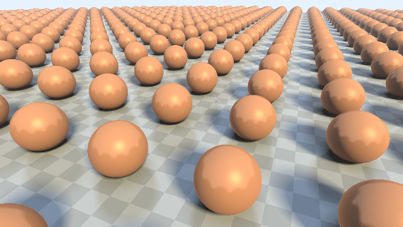

# [CIS565 2015F] YOUR TITLE HERE

**GLSL Ray Marching**

**University of Pennsylvania, CIS 565: GPU Programming and Architecture, Project 5**

* Ziye Zhou
* Tested on:  **Google Chrome 41.0.2272.89 m** on
  Windows 10, i7-4710MQ @ 2.50GHz 32GB, AMD HD8970M (Personal Laptop)

### Live on Shadertoy

### Acknowledgements

This Shadertoy uses material from the following resources:

* {CIS 565 slides}
  [slides](http://cis565-fall-2015.github.io/lectures/12-Ray-Marching.pptx)
* {McGuire}
  Morgan McGuire, Williams College.
  *Numerical Methods for Ray Tracing Implicitly Defined Surfaces* (2014).
  [PDF](http://graphics.cs.williams.edu/courses/cs371/f14/reading/implicit.pdf)
* {iq-prim}
  Iñigo Quílez.
  *Raymarching Primitives* (2013).
  [Shadertoy](https://www.shadertoy.com/view/Xds3zN)
* {iq-terr}
  Iñigo Quílez.
  *Terrain Raymarching* (2007).
  [Article](http://www.iquilezles.org/www/articles/terrainmarching/terrainmarching.htm)
* {iq-rwwtt}
  Iñigo Quílez.
  *Rendering Worlds with Two Triangles with raytracing on the GPU* (2008).
  [Slides](http://www.iquilezles.org/www/material/nvscene2008/rwwtt.pdf)
*{Nop Jiarathanakul's BLOG}
  [Article](http://nopjia.blogspot.com/search?updated-min=2012-01-01T00:00:00-05:00&updated-max=2013-01-01T00:00:00-05:00&max-results=27)

