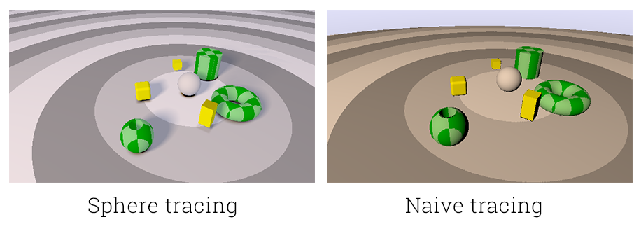
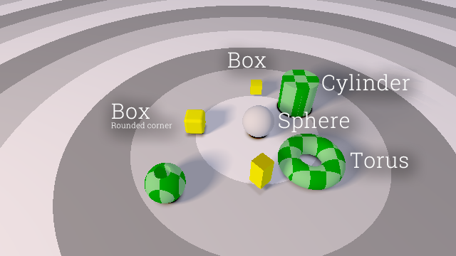
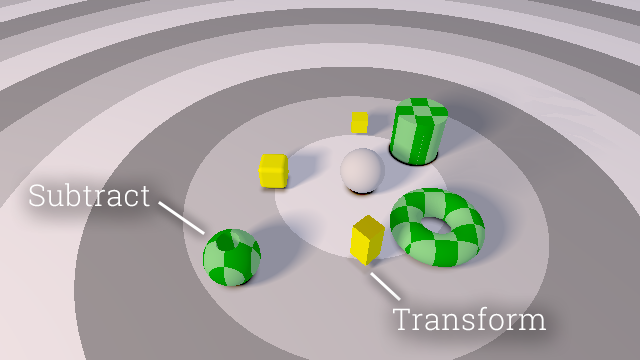
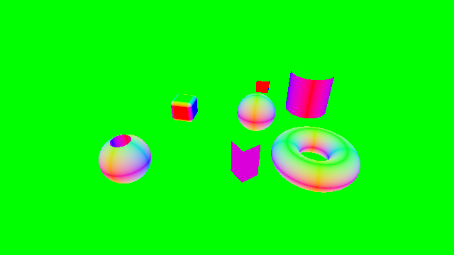
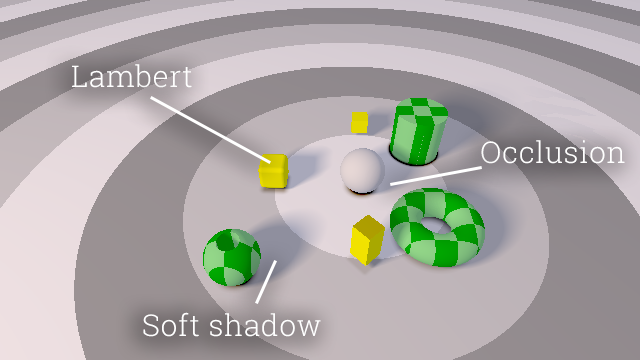
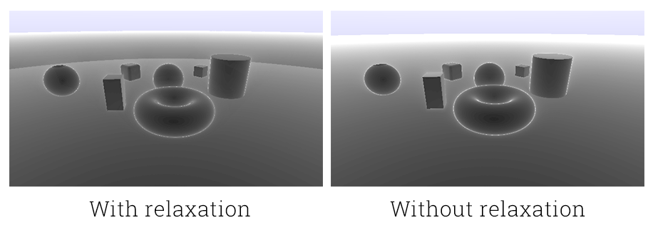
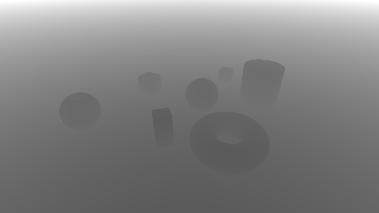
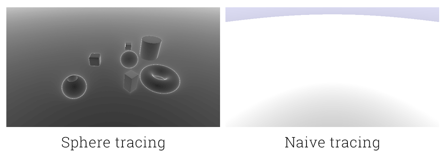
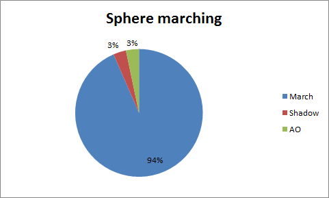

# [CIS565 2015F] Raymarching Fun

**GLSL Ray Marching**

**University of Pennsylvania, CIS 565: GPU Programming and Architecture, Project 5**

* Tongbo Sui
* Tested on: Google Chrome 46.0.2490.71 on Windows 10, i5-3320M @ 2.60GHz 8GB, NVS 5400M 2GB (Personal)

### Live on Shadertoy

### Acknowledgements

This Shadertoy uses material from the following external resources:
* Checker board material: https://www.shadertoy.com/view/Xds3zN

Basic scene setup using {iq-prim}

### Features

* Ray marching
  * Naive ray marching {McGuire}
    * Uses fixed step size to progress rays
    * Progression is bounded by maximum distance
  * Sphere tracing {McGuire}
    * Uses variable step size based on estimated distances
    * Progression is bounded by maximum stepping iterations
  * *Branch divergence*: both tracing method will allow a thread to terminate early if the pixel ray hits an explicit surface. Therefore it's highly possible that branches are diverged, since there is no set way to group those terminated with those did not on the fly.

###### Naive and sphere tracing

* Distance estimators {McGuire}
  * Estimators
    * Sphere
    * Box
    * Plane
    * Rounded corner box
    * Torus
    * Cylinder
  * *Branch divergence*: shouldn't have any effects since they do straight calculations

###### Distance estimators

* Transformation operator {McGuire}
  * Takes a set `(vec3 translate, mat3 rotate, vec3 scale)` as input, and will transform the points in the inverse direction
  * *Branch divergence*: shouldn't have any effects since they do straight calculations

* Distance operators {McGuire}
  * Union
  * Subtraction
  * *Branch divergence*: branching only happens with in the distance operators. If the scene is setup in a particular way, then all threads would branch the same way, hence no visible performance impacts. Otherwise there would be some divergence.

###### Distance operators

* Normal computation {McGuire}
  * Estimate surface normal on intersection point with differentiation
  * *Branch divergence*: shouldn't have any effects since they do straight calculations

###### Normal

* Lambert lighting with effects (sphere tracing only)
  * Soft shadow {iq-shadow}
    * Shadow with faked softness
    * Shadow calculated by shooting rays from surface to light, and evaluate the closest surface hit by such rays. Multiple samples are taken to get the best result
    * *Branch divergence*: same as ray marching
  * Ambient occlusion {ljt-ao}
    * Similar to soft shadow, but takes all samples into account instead of picking the best one
    * Rays are shot from surface along normals, and stepped in fixed step size
    * At each sample point the occlusion is calculated by the amount of the march sphere covered by some other surface
    * *Branch divergence*: same as ray marching

###### Lighting effects

* Over-relaxation for sphere tracing {McGuire}
  * Over-shoot the ray during marching in hope for hitting a surface in less iterations
  * Implementation wise ineffective
    * Due to the current implementation, the over-shooting is calculated the exact same way as for step size. Therefore at each iteration there are 2 calls to distance estimators, which essentially doubled the computation time compared to implementation without relaxation
    * With over-relaxation: 44.7 FPS
    * Without: 55.7 FPS
  * Iteration-wise effective
    * The over-relaxation indeed reduced iteration counts to surfaces
    * However this may not be enough to offset the overhead brought by the current implementation
  * *Branch divergence*: threads would diverge at the point where they decide whether the over-shot can be accepted. However this shouldn't be a significant performance impact since it happends at the end of the entire computation
  * *Possible improvement*: only estimate related surfaces, instead of all surfaces

###### Per fragment iteration with and without over-relaxation. Brighter means more iterations. Notice reduced iteration count on edges, and also on plane

* Debug views
  * Distance to surface for each pixel
  * Number of ray march iterations used for each pixel
  * Surface normal

###### Depth

### Analysis

* Naive ray marching vs. sphere tracing
  * Sphere tracing offers a significant improvement over naive tracing
    * Sphere: 16ms / 57.7 FPS
    * Naive: 100ms / 10.6 FPS
  * As shown below. Naive tracing can have siginificantly more iterations per ray, since it steps a fixed amount at each iteration
  * Sphere tracing requires much less efforts to hit the surface in comparison. The variable step size would allow the ray to leap forward when space is empty, and fine tune its steps when space is crowded

###### Per fragment iteration. Brighter means more iterations

###### Time spent marching vs. shading

### References

* {McGuire} Morgan McGuire, Williams College.*Numerical Methods for Ray Tracing Implicitly Defined Surfaces* (2014)
  * http://graphics.cs.williams.edu/courses/cs371/f14/reading/implicit.pdf
* {iq-prim} Iñigo Quílez.*Raymarching Primitives* (2013)
  * https://www.shadertoy.com/view/Xds3zN
* {iq-shadow} Iñigo Quílez.
  * http://www.iquilezles.org/www/articles/rmshadows/rmshadows.htm
* {ljt-ao} Lukasz Jaroslaw Tomczak. *GPU Ray Marching of Distance Fields*
  * http://www2.compute.dtu.dk/pubdb/views/edoc_download.php/6392/pdf/imm6392.pdf
