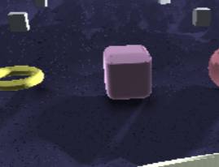
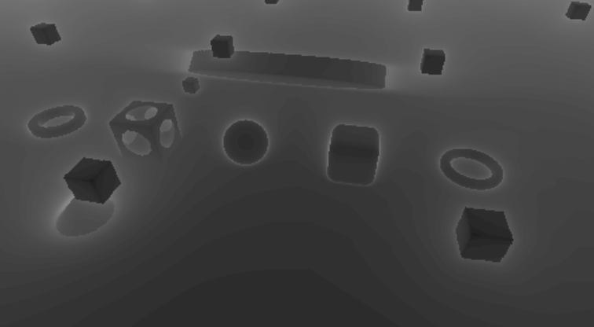

# [CIS565 2015F] YOUR TITLE HERE

**GLSL Ray Marching**

**University of Pennsylvania, CIS 565: GPU Programming and Architecture, Project 5**

siqi Huang Tested on: Windows 7, Inter(R) Core(TM) i7-4870 HQ CPU@ 2.5GHz; GeForce GT 750M(GK107) (Personal Computer)

Representative Images:

#PART O: Operations

define mode

case 1: Smart Ray Casting 

case 2: Naive Ray Casting

case 3: Height Map

case 4: Fractals

case 5: Ambient Occlusion and Soft Shadows

case 6: Debug View

#PART I: Different Ray Marching Methods

Sphere:

The sphere method is pretty simple, compute the distance from the ray to the center of the sphere. Normal is easy to get too.

Cube:

The cube is a little difficult than the sphere. You have to decide which direction goes to the boundary first, which means which is the biggest among xyz in absolute value. Then the normal has only 6 values.

Cylinder:

The cylinder is the combination of cube and sphere. in y direction, compute like cube, in xz direction compute like sphere.

#PART II: Naive Ray Marching vs Smart Ray Marching

In naive ray marching, the move step is fixed. So the time used in linear to the iteration number.
In smart ray marching, the move step is dynamic, based on the distance to the nearest object. So the time is constant.
However, the smart time cannot do feature like height map and fractal which is talked below, naive can do both.
The performance analysis is in the last part.

#PART III: Lambert and Blinn-phong Effect

When we get the distance to the object and the normal, we get the intersection point. Given the ray position and light position, using what we have done in previous GPU projects, it is easy to get all those effects.

#PART IV: Object Transformation

To transform an object, we can size it up, move it and rotate it. All those all defined using matrix multiplication. After the transformation, we need to transform both the ray position and direction to the object coordinate. So we get the following results:

The images here has the lighting effects, but have no ambient occlusion and soft shadows. I have tried to apply those to them but failed. Because the ambient occlusion and soft shadows need to specify fixed position of objects without movement, which is not possible for transformation, so I split them as separate demonstration here. 

#PART V: Debug View

Here I used the distance to the camera to show the debug view. Instead of compute the light color, just use the distance to the object divide the max distance and get the color.

#PART VI: Ambient Occlusion and Soft Shadows:

For this part of the code, I referred a lot from the (3). The mapping function is different from the source, it returns a vecter4 with xyz a normal and w the distance to the object. The color calculation is basically borrowed from the source. The result is great.

 
#PART VII: Height Map:

This part is a little interesting. I have to use naive method to do this part. For every x and z value of a coordinate, I use a height function(like y=cos(2.1x)*sin(2.3z)) to compute the height, if the height is greater than y, then the ray hit the map and return, otherwise it marches on. The height function is the most important part.
Those two images used different height functions:

#PART VIII: Fractal:

This part we still have to use naive method.
I only implemented the cube fractal here.
Here we define a variable level as the iteration level of the fractal.
Each time we hit a cube, we find out to which section does it intersect. We divide the cube into 27 small cube. If the intersected one is in the center or on the center of each face, then we say nothing hit and the ray marches on. Otherwize we go to the next level and divide the intersected cube into smaller27 cubes until it does not hit or the level goes beyond the threshould. After we found the intersection distance, we just do another cube interseciton to get the normal.

#PART IX: Performance Analysis:

The performance analysis shows two comparisons:
The naive and smart ray casting methods:

In different iteration, the smart method has fixed 60 fps because it is done in constant time(the iteration is not finished before it is broken). But the naive method slows down when number of iteration is large

The level vs fps in fractals:

Different level lead to different fps. Level from 1 to 4 has no fps difference probably because of the fps cut to 60. After 4, the speed drop drastically. The Level influences the speed in an exponential way.

#PART X: References:

1 CIS 562 Course Note

2 {McGuire} Morgan McGuire, Williams College. Numerical Methods for Ray Tracing Implicitly Defined Surfaces (2014)

3 {iq-prim} Iñigo Quílez. Raymarching Primitives (2013).
