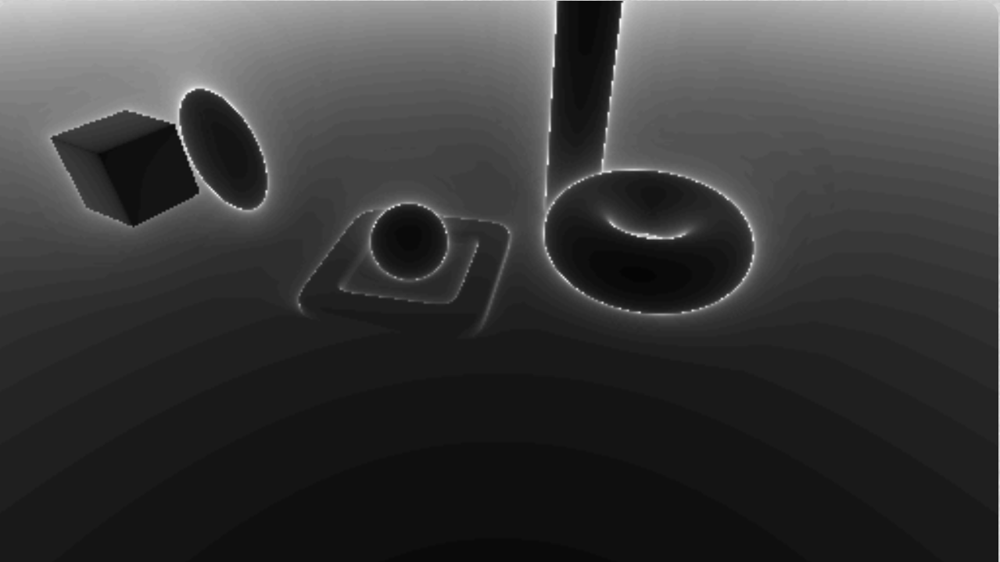

# [CIS565 2015F] Ray Marcher in Shadertoy

**GLSL Ray Marching**

**University of Pennsylvania, CIS 565: GPU Programming and Architecture, Project 5**

* Levi Cai
* Tested on: (TODO) **Google Chrome** on
* Windows 8, i7-5500U @ 2.4GHz, 12GB, NVidia GeForce 940M 2GB
* 
### Live on Shadertoy

### Acknowledgements

This Shadertoy uses material from the following resources:

* http://www.iquilezles.org/www/articles/terrainmarching/terrainmarching.htm for height map methodology
* http://www.iquilezles.org/www/material/nvscene2008/rwwtt.pdf
* http://www.iquilezles.org/www/articles/distfunctions/distfunctions.htm for SDFs and Transformations
* https://www.shadertoy.com/view/Xds3zN for ambient occlusion and soft shadows
* http://www.neilmendoza.com/glsl-rotation-about-an-arbitrary-axis/ for axis/angle to matrix rotations
* Morgan McGuire, Williams College. Numerical Methods for Ray Tracing Implicitly Defined Surfaces (2014) for over-relaxation

### Features

* Naive Ray Marching
* Sphere Tracing
* 7 SDFs: Plane, sphere, ellipsoid, torus, torus88, box, cylinder
* Arbitrary transformations of objects
* Debug views for number of ray march iterations and distances to surfaces
* Simple lambert lighting scheme
* Height Maps
* Over-relaxation for sphere tracing optimization
* Soft shadowing (both heavily influenced by IQ's shadertoy example...)
* Ambient Occlusion
* Naive coloring (lots of branch divergence!)

### Features and Analysis

## Height Mapping

## Naive Marching vs. Sphere Tracing

Black is 0, white is max number of steps.

Naive:

Runs at 20FPS. Goes faster when objects are closer because they terminate much faster. Same with increasing stepsize and resoluton. However, regardless, sphere tracing removes this necessity all together.

Sphere:

Runs at 60FPS. Here we can see some of the downsides of sphere tracing around the edges of objects. Objects themselves are much faster to compute, but around the edges, because sphere tracing computes distances to nearest object (not necessarily in its path), it will take much smaller step sizes near edges of objects, hence why the edges are very white and look like they distort the background around them.

## Over-Relaxation Optimization for Sphere Tracing

Black is 0, white is max number of steps.

Normal sphere:

Over-relaxed sphere:

It is clear from the images that the over relaxed method takes less steps in most fragements when compared with the normal sphere stepping. However, due to my implementation, it seems that in certain scenarios it is actually slower when there are many objects nearby the camera frame. I believe this might be because of the additional distance computation I do. It might make sense to somehow only do 1 distance computation per iteration and re-use the previous computation (I do 2 per iteration) which might be the cause of this.

## Branch Divergence

The largest branch divergence hit is my super naive implementation of color, in the getColor function, which does 4-condition branch to determine what color to use given a material. A faster way to implement this is just to apply the color directly directly in the map function, but I think this illustrates the issue with branches quickly, and was quick to implement. Adding this feature drops my runtime from 60FPS to 45FPS.

### Pull Request

**Even though your code is on Shadertoy, make sure it is also on GitHub!**

1. Open a GitHub pull request so that we can see that you have finished.
   The title should be "Submission: YOUR NAME".
   * **ADDITIONALLY:**
     In the body of the pull request, include a link to your repository.
2. Send an email to the TA (gmail: kainino1+cis565@) with:
   * **Subject**: in the form of `[CIS565] Project N: PENNKEY`.
   * Direct link to your pull request on GitHub.
   * Estimate the amount of time you spent on the project.
   * If there were any outstanding problems, or if you did any extra
     work, *briefly* explain.
   * Feedback on the project itself, if any.
