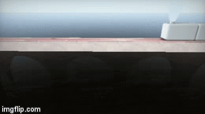

# [CIS565 2015F] Ray Marcher

**GLSL Ray Marching**

**University of Pennsylvania, CIS 565: GPU Programming and Architecture, Project 5**

* Megan Moore
* Tested on: **Google Chrome** on
  MacBook Pro 2.6 GHz Intel Core i5 @ 8 GB 1600 MHz DDR3, Intel Iris 1536 MB 

### Live on Shadertoy 

### Acknowledgements

This Shadertoy uses material from the following resources:
Morgan McGuire, Williams College.
*Numerical Methods for Ray Tracing Implicitly Defined Surfaces* (2014).
[PDF](http://graphics.cs.williams.edu/courses/cs371/f14/reading/implicit.pdf)

Iñigo Quílez.
*Terrain Raymarching* (2007).
[Article](http://www.iquilezles.org/www/articles/terrainmarching/terrainmarching.htm)

Iñigo Quílez.
*Terrain Raymarching* (2007).
[Article](http://www.iquilezles.org/www/articles/terrainmarching/terrainmarching.htm)
  
http://www.iquilezles.org/www/articles/menger/menger.htm - mendel sponge
https://en.wikipedia.org/wiki/Blinn%E2%80%93Phong_shading_model - blinn-phong lighting
http://graphics.cs.williams.edu/courses/cs371/f14/reading/implicit.pdf - ray marching/sphere tracing
http://www2.compute.dtu.dk/pubdb/views/edoc_download.php/6392/pdf/imm6392.pdf - ambient occlusion/soft shadows
https://www.shadertoy.com/view/4t2SRz - smoke color
https://www.shadertoy.com/view/MdXGW2 - water

###Final Image with debug views

   

**Summary:** In this project, you'll see yet another way in which GPU
parallelism and compute-efficiency can be used to render scenes.
I wrote a program in the popular online shader editor
[Shadertoy](http://www.shadertoy.com/).

Ray marching is an iterative ray casting method in which objects are
represented as implicit surfaces defined by signed distance functions (SDFs). This
method is widely used in the Shadertoy community to render complex scenes which
are defined in the fragment shader code executed for each pixel.

### Features

**Required Features:**

* Two ray marching methods (comparative analysis required)
  * Naive ray marching (fixed step size) {McGuire 4}
    * The naive ray marching method requires a ray to be shot from the camera to each different pixel in the image.  Then, given a step size, we march down the ray step by step and determine what the minimum distance is from that point to all of the "objects" in the scene.  When this distance drops below an epsilon, you can stop the ray march and print the color of the object that ray has hit.  If the total distance you have stepped along the ray surpasses your max distance, you stop marching and assume that ray does not hit anything.  As you can imagine, this technique can be very slow, since there is no optimization, and the step size is very small.  This is why the sphere tracing was implemented to help speed up the frame rate.
  * Sphere tracing (step size varies based on signed distance field) {McGuire 6}
    * The difference between sphere tracing and ray marching is the step size.  Instead of marching down the ray with a constant step size, we find the largest possible step we can take without hitting any objects.  In order to do this, the beginning method is the same as the ray march, we find the distant from the point to each object in the scene.  But then, even if the distance is not less than our epsilon, we take a step in the direction of the ray that is a length equal to the minimum distance the point is away from the objects.  This allows you to take the largest possible next step without stepping over any objects.  This helps make the run time much faster you are taking less steps with each ray.  
* 3 different distance estimators {McGuire 7} {iq-prim}
  * With normal computation {McGuire 8}
  * I ended up using many different distance estimators throughout each of my scenes.  I implemented the sphere, plane, cube, rounded cube, capsule, torus, cross, and cylinder.   Distance estimators are the reason that the scene can be rendered with just two triangles, instead of multiple objects.  The rays are not actually intersecting with objects that are in the scene.  When the distance is being calculated, you use a distance estimator to find how far the point is from the object, if it were to be there.  This helps to allow complicated scenes render very quickly, because there are not actual objects being rendered, but the correct color is being calculated.  
* One simple lighting computation (e.g. Lambert or Blinn-Phong).
  *  I implemented a Blinn-Phong lighting scheme.  Each object has it's own diffuse color.  Then, after calculating it's normal, the dot product of the normal and the light vector is used to determine how much diffuse and specular light will be seen.  This image shows three white objects that have a blinn-phong lighting applied to them
 

* Union operator {McGuire 11.1}
  * The union operator allows for multiple objects to be rendered in the same scene.  The implementation of the union operator requires the comparison of each distance from the point to each object.  The object that has the minimum distance from the point on the ray should be drawn.  Thus, the union operator compares these distances and takes the minimum.  I do this in my scene function, comparing the t value of each object in the scene and choosing the minimum value to be drawn.  
* Transformation operator {McGuire 11.5}
  * The transformation operator was implemented by creating a transformation matrix.  The inputs into the function were the translation, rotation, and scale vector.  Each coordinate in the rotation matrix represents the rotation about the x, y, or z axis. The inverse of this matrix is multiplied by the center of the object, and the product of this gives the correct new position.   The image below shows a cube being rotated about the z axis around the origin. 

 
  
* Debug views (preferably easily toggleable, e.g. with `#define`/`#if`)
  * There are three differenct debug views that can be used in my scene.  The first is the normals, which will color each point on an object the color of the calculated normal at the point on the suface.  The second is the number of steps along the ray that are taken before it hits an object.  In the view, the less steps taken along a ray print black, while the larger amount of steps taken along a ray print a red color.  The last debug view is the distance to the surface for each pixel.  This will print a black color for objects that are close and white for objects that are further away.  These veiws can easily be toggled between at the top of the script. 

**Extra Features:**

* Other basic distance estimators/operations {McGuire 7/11}
  * Some other operators that I implemented were the difference, displacement, and repeat operators.  Below is an image of the repeat operator (the others have been shown in previos images).  These operations take the value given by the distance estimators and tweak them in some way to change the shape that is being generated.  

* Advanced distance estimators
  * Height-mapped terrain rendering {iq-terr}
    * Height map terrain can be used to render complicated and never ending terrain very quickly.  This is done by using a texture to deterine the height of the terrain at each pixel.  The height of the point along the ray is compared to a value determined from the texture at specific coordinates.  This value can be manipulated in amany different ways to help get the desired resultes.  In this case, I used the average of the R, G, and B values of the color at those texture coordinates.  The image below shows a height map using a checkered texture.  While this method is very useful for rendering complicated scenes, it does require you use the naive method.  This is because you do not have specific objects in the scene, you have a height for each pixel given by the texture, and you would have to compare the distance of each spot on the terrain (each pixel).   This would end up taking much longer than just stepping through the ray by a constant value.  
  
  

  * Fractal rendering (e.g. Menger sponge or Mandelbulb {McGuire 13.1})
    * The fractal rendering shows a repeating desing on an object.  In the image below, it shows the difference of a box and cross repeating on the cube.  This is done by using the difference estimators fro the box and cross, along with the difference operator.  Then, you iterate through and apply the pattern to each smaller section of the cube.  The more iterations you step through, the more repetitions of the patter will appear on the object.  Thread divergence is not an issue in this implementation, and it can be used with both the naive ray march and sphere tracing.  
  
  
  
* Lighting effects
  * Soft shadowing using secondary rays {iq-prim} {iq-rwwtt p55}
    *  Soft shadowing requires a secondary ray cast.  This secondary ray is cast from the intersected surface point and directed towards the light.  If the ray intersects the light, then no shadow will be applied.  If the ray hits another object before reaching the light, a shadow is drawn.  The implementation of soft shadowing can take up a lot of time when rendering.  This is because, not only does it cause for more ray marching (using the sphere tracing), but it also can cause thread divergence.  
  

 
  * Ambient occlusion {iq-prim}
  
  

###Bridge and Train - Step by step break down

Here the box and capsule distance estimators were used with the difference and repeat operators.  The capsoles are being repeated along the x axis and are being subtracted from the rectangle that makes up the bridge.

The smoke uses a sphere and a noise function as it's distance estimator.  The noise function changes because the variable iGlobalTime is used to compute how much noise is implemented into the sphere.  This image allows you to see the smokes movements much better than the final picture.  Because the size of the smoke had to be small, the noise was cut back.  

Here the bridge and train appear to be under the water.  This was happening because the color at each pixel added a reflection distrotion as long as the height of the water was less than 200, which is the horizon line.  This needed to be changed, so that instead of comparing the height to the horizon line, it compared it to all other obejcts in the scene.  This way, if the object was above the water at the distance, it would not have a reflection distoriton added to the scene.  

For each feature (required or extra), include a screenshot which clearly
shows that feature in action. Briefly describe the feature and mention which
reference(s) you used.

### Analysis

* Provide an analysis comparing naive ray marching with sphere tracing
  * In addition to FPS, implement a debug view which shows the "most expensive"
    fragments by number of iterations required for each pixel. Compare these.
* Compare time spent ray marching vs. time spent shading/lighting
  * This can be done by taking measurements with different parts of your code
    enabled (e.g. raymarching, raymarching+shadow, raymarching+shadow+AO).
  * Plot this analysis using pie charts or a 100% stacked bar chart.
* For each feature (required or extra), estimate whether branch divergence
  plays a role in its performance characteristics, and, if so, point out the
  branch in question.
  (Like in CUDA, if threads diverge within a warp, performance takes a hit.)

### Resources

You **must** acknowledge any resources you use, including, but not limited to,
the links below. **Do not copy non-trivial code verbatim.** Instead, use the
references to understand the methods.

For any code/material in the 565
[slides](http://cis565-fall-2015.github.io/lectures/12-Ray-Marching.pptx),
please reference the source found at the bottom of the slide.

* {McGuire}
  Morgan McGuire, Williams College.
  *Numerical Methods for Ray Tracing Implicitly Defined Surfaces* (2014).
  [PDF](http://graphics.cs.williams.edu/courses/cs371/f14/reading/implicit.pdf)
  * You may credit and use code from this reference.
* {iq-prim}
  Iñigo Quílez.
  *Raymarching Primitives* (2013).
  [Shadertoy](https://www.shadertoy.com/view/Xds3zN)
* {iq-terr}
  Iñigo Quílez.
  *Terrain Raymarching* (2007).
  [Article](http://www.iquilezles.org/www/articles/terrainmarching/terrainmarching.htm)
  * You may credit and use code from this reference.
* {iq-rwwtt}
  Iñigo Quílez.
  *Rendering Worlds with Two Triangles with raytracing on the GPU* (2008).
  [Slides](http://www.iquilezles.org/www/material/nvscene2008/rwwtt.pdf)
* {Ashima}
  Ashima Arts, Ian McEwan, Stefan Gustavson.
  *webgl-noise*.
  [GitHub](https://github.com/ashima/webgl-noise)
  * You may use this code under the MIT-expat license.

## Submit

### Post on Shadertoy

Post your shader on Shadertoy (preferably *public*; *draft* will not work).
For your title, come up with your own demo title and use the format
`[CIS565 2015F] YOUR TITLE HERE` (also add this to the top of your README).

In the Shadertoy description, include the following:

* A link to your GitHub repository with the Shadertoy code.
* **IMPORTANT:** A copy of the *Acknowledgements* section from above.
  * Remember, this is public - strangers will want to know where you got your
    material.

Add a screenshot of your result to `img/thumb.png`
(right click rendering -> Save Image As), and put the link to your
Shadertoy at the top of your README.

### Pull Request

**Even though your code is on Shadertoy, make sure it is also on GitHub!**

1. Open a GitHub pull request so that we can see that you have finished.
   The title should be "Submission: YOUR NAME".
   * **ADDITIONALLY:**
     In the body of the pull request, include a link to your repository.
2. Send an email to the TA (gmail: kainino1+cis565@) with:
   * **Subject**: in the form of `[CIS565] Project N: PENNKEY`.
   * Direct link to your pull request on GitHub.
   * Estimate the amount of time you spent on the project.
   * If there were any outstanding problems, or if you did any extra
     work, *briefly* explain.
   * Feedback on the project itself, if any.
