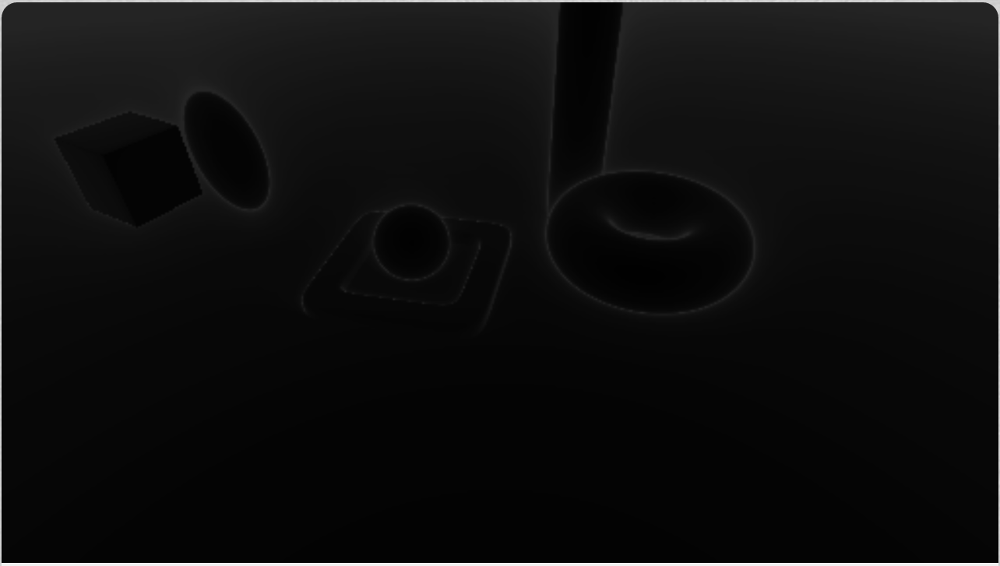

# [CIS565 2015F] Ray Marcher in Shadertoy

**GLSL Ray Marching**

**University of Pennsylvania, CIS 565: GPU Programming and Architecture, Project 5**

* Levi Cai
* Tested on: (TODO) **Google Chrome** on
* Windows 8, i7-5500U @ 2.4GHz, 12GB, NVidia GeForce 940M 2GB
* 
### Live on Shadertoy

### Acknowledgements

This Shadertoy uses material from the following resources:

* http://www.iquilezles.org/www/articles/terrainmarching/terrainmarching.htm for height map methodology
* http://www.iquilezles.org/www/material/nvscene2008/rwwtt.pdf
* http://www.iquilezles.org/www/articles/distfunctions/distfunctions.htm for SDFs and Transformations
* https://www.shadertoy.com/view/Xds3zN for ambient occlusion and soft shadows
* http://www.neilmendoza.com/glsl-rotation-about-an-arbitrary-axis/ for axis/angle to matrix rotations

### Features

* Naive Ray Marching
* Sphere Tracing
* 7 SDFs: Plane, sphere, ellipsoid, torus, torus88, box, cylinder
* Arbitrary transformations of objects
* Debug views for number of ray march iterations and distances to surfaces
* Simple lambert lighting scheme
* Height Maps
* Over-relaxation for sphere tracing optimization
* Soft shadowing (both heavily influenced by IQ's shadertoy example...)
* Ambient Occlusion

### Analysis

## Naive Marching vs. Sphere Tracing

Black is 0, white is max number of steps.

Runs at 20FPS. Goes faster when objects are closer because they terminate much faster. Same with increasing stepsize and resoluton. However, regardless, sphere tracing removes this necessity all together.

Runs at 60FPS. Here we can see some of the downsides of sphere tracing around the edges of objects. Objects themselves are much faster to compute, but around the edges, because sphere tracing computes distances to nearest object (not necessarily in its path), it will take much smaller step sizes near edges of objects, hence why the edges are very white and look like they distort the background around them.

* Provide an analysis comparing naive ray marching with sphere tracing
  * In addition to FPS, implement a debug view which shows the "most expensive"
    fragments by number of iterations required for each pixel. Compare these.
* Compare time spent ray marching vs. time spent shading/lighting
  * This can be done by taking measurements with different parts of your code
    enabled (e.g. raymarching, raymarching+shadow, raymarching+shadow+AO).
  * Plot this analysis using pie charts or a 100% stacked bar chart.
* For each feature (required or extra), estimate whether branch divergence
  plays a role in its performance characteristics, and, if so, point out the
  branch in question.
  (Like in CUDA, if threads diverge within a warp, performance takes a hit.)
* For each optimization feature, compare performance with and without the
  optimization. Describe and demo the types of scenes which benefit from the
  optimization.

**Tips:**

* To avoid computing frame times given FPS, you can use the
  [stats.js bookmarklet](https://github.com/mrdoob/stats.js/#bookmarklet)
  to measure frame times in ms.

### Resources

You **must** acknowledge any resources you use, including, but not limited to,
the links below. **Do not copy non-trivial code verbatim.** Instead, use the
references to understand the methods.

For any code/material in the 565
[slides](http://cis565-fall-2015.github.io/lectures/12-Ray-Marching.pptx),
please reference the source found at the bottom of the slide.

* {McGuire}
  Morgan McGuire, Williams College.
  *Numerical Methods for Ray Tracing Implicitly Defined Surfaces* (2014).
  [PDF](http://graphics.cs.williams.edu/courses/cs371/f14/reading/implicit.pdf)
  * You may credit and use code from this reference.
* {iq-prim}
  Iñigo Quílez.
  *Raymarching Primitives* (2013).
  [Shadertoy](https://www.shadertoy.com/view/Xds3zN)
* {iq-terr}
  Iñigo Quílez.
  *Terrain Raymarching* (2007).
  [Article](http://www.iquilezles.org/www/articles/terrainmarching/terrainmarching.htm)
  * You may credit and use code from this reference.
* {iq-rwwtt}
  Iñigo Quílez.
  *Rendering Worlds with Two Triangles with raytracing on the GPU* (2008).
  [Slides](http://www.iquilezles.org/www/material/nvscene2008/rwwtt.pdf)
* {Ashima}
  Ashima Arts, Ian McEwan, Stefan Gustavson.
  *webgl-noise*.
  [GitHub](https://github.com/ashima/webgl-noise)
  * You may use this code under the MIT-expat license.

## Submit

### Post on Shadertoy

Post your shader on Shadertoy (preferably *public*; *draft* will not work).
For your title, come up with your own demo title and use the format
`[CIS565 2015F] YOUR TITLE HERE` (also add this to the top of your README).

In the Shadertoy description, include the following:

* A link to your GitHub repository with the Shadertoy code.
* **IMPORTANT:** A copy of the *Acknowledgements* section from above.
  * Remember, this is public - strangers will want to know where you got your
    material.

Add a screenshot of your result to `img/thumb.png`
(right click rendering -> Save Image As), and put the link to your
Shadertoy at the top of your README.

### Pull Request

**Even though your code is on Shadertoy, make sure it is also on GitHub!**

1. Open a GitHub pull request so that we can see that you have finished.
   The title should be "Submission: YOUR NAME".
   * **ADDITIONALLY:**
     In the body of the pull request, include a link to your repository.
2. Send an email to the TA (gmail: kainino1+cis565@) with:
   * **Subject**: in the form of `[CIS565] Project N: PENNKEY`.
   * Direct link to your pull request on GitHub.
   * Estimate the amount of time you spent on the project.
   * If there were any outstanding problems, or if you did any extra
     work, *briefly* explain.
   * Feedback on the project itself, if any.
