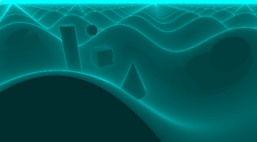

# GLSL Ray Marching

**University of Pennsylvania, CIS 565: GPU Programming and Architecture, Project 5**

* Bradley Crusco
* Tested on: Google Chrome 46 on Windows 10, i7-3770K @ 3.50GHz 16GB, 2 x GTX 980 4096MB (Personal Computer)

### Live on Shadertoy (TODO)

[](https://www.shadertoy.com/view/TODO)

## Description

TODO

## Features

### Naive Ray Marching

Ray marching with a fixed step size. Refer to the analysis section for more information on this method.

### Sphere Tracing

Ray marching using a variable step size based on a signed distance field. Refer to the analysis section for more information on this method.

### Distance Estimators
Distance estimators are used to define the objects in our scene. Support for the following basic distance estimators is provided:
* Sphere {[McGuire 7.1](http://graphics.cs.williams.edu/courses/cs371/f14/reading/implicit.pdf)}
* Plane {[McGuire 7.2](http://graphics.cs.williams.edu/courses/cs371/f14/reading/implicit.pdf)}
* Box {[McGuire 7.3](http://graphics.cs.williams.edu/courses/cs371/f14/reading/implicit.pdf)}
* Rounded Box {[McGuire 7.4](http://graphics.cs.williams.edu/courses/cs371/f14/reading/implicit.pdf)}
* Torus {[McGuire 7.5](http://graphics.cs.williams.edu/courses/cs371/f14/reading/implicit.pdf)}


### Height-Mapped Terrain Distance Estimator

Implemented based on the method outlined by Inigo Quilez [here](http://www.iquilezles.org/www/articles/terrainmarching/terrainmarching.htm). The height-map is defined by a simple function: ```point.y - height * sin(length * point.x) * cos(point.z)```


### Mandelbulb Fractal Distance Estimator

Implemented based on the method outlined [here](https://www.shadertoy.com/view/XsXXWS), this distance estimator renders the mandelbulb fractal object.


### Lambert Lighting Computation
A simple Lambert lighting computation was used for rendering. Below is an example render using the Lambert computation without soft shadows.

#### Lambert Lighting Image (No Soft Shadows)


### Soft Shadows
Soft shadows are added by completing a second ray march to the light, and scaling the shadow by the ratio of the change in distance and the total distance on each iteration of the march.

#### Lambert Lighting Image (Soft Shadows)


### Distance Operators

Distance estimators are used to define the objects in our scene. Support for the following basic distance estimators is provided:
Distance operators are used to add, remove, and combine basic shapes from the distance estimators into a full, complex scene. Support for the following distance operators is provided:

* Union {[McGuire 11.1](http://graphics.cs.williams.edu/courses/cs371/f14/reading/implicit.pdf)}
* Intersection {[McGuire 11.2](http://graphics.cs.williams.edu/courses/cs371/f14/reading/implicit.pdf)}
* Subtraction {[McGuire 11.3](http://graphics.cs.williams.edu/courses/cs371/f14/reading/implicit.pdf)}
* Displacement {[McGuire 11.5](http://graphics.cs.williams.edu/courses/cs371/f14/reading/implicit.pdf)}
* Blending {[McGuire 11.6](http://graphics.cs.williams.edu/courses/cs371/f14/reading/implicit.pdf)}
* Transformation {[McGuire 11.5](http://graphics.cs.williams.edu/courses/cs371/f14/reading/implicit.pdf)}

### Debug Views
There are two debug views provided. The first shows the distance to the surface for each pixel. It can be activated by uncommenting the DISTANCE_COLOR definition in the shader. The second shows the number of ray march iterations used for each pixel. It can be activated by uncommenting the STEP_COUNT_COLOR definition in the shader. Below are examples of both images.

#### Distance Debug Image


#### Step Count Debug Image


## Analysis

### Naive Marching vs. Sphere Tracing
There are two ways to compare naive ray marching and sphere tracing. The first is to measure the time to render a frame in miliseconds and compare the values for both methods. Unfortunately here, even for the complex mandelbulb example, both the naive and sphere methods give a result of 16ms per frame. The other way to do this is to visually compare the methods by uncommenting the STEP_COUNT flag and comparing the results.

#### Naive Marching Step Count Image


#### Sphere Tracing Step Count Image


### Acknowledgements
* [Morgan McGuire: Numerical Methods for Ray Tracing Implicitly Defined Surfaces](http://graphics.cs.williams.edu/courses/cs371/f14/reading/implicit.pdf)
* [Inigo Quilez: Terrain Raymarching](http://www.iquilezles.org/www/articles/terrainmarching/terrainmarching.htm)
* [morgan3d: Mandelbulb Explained](https://www.shadertoy.com/view/XsXXWS)
