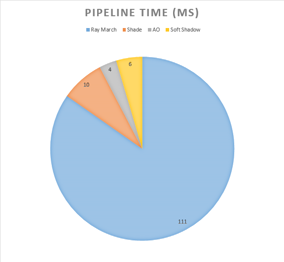
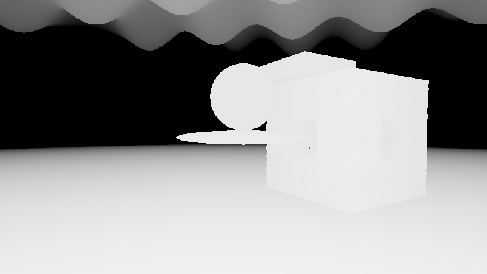

# [CIS565 2015F] YOUR TITLE HERE

**GLSL Ray Marching**

**University of Pennsylvania, CIS 565: GPU Programming and Architecture, Project 5**

* Shuai Shao (Shrek)
* Tested on: **Google Chrome 46.0.2490.71 m** on
  Windows 10, i7-4710HQ @ 2.50GHz 16GB, GeForce GTX 970M (Personal)

### Live in Shadow Toy : All features in Image (A Nonsense Image ... -_-!!! I do want to make somthing meaningful at first...)

### TODO: NonTrivial Image (write something good-looking and meaningful)

### Acknowledgements

This Shadertoy uses material from the following resources:
* {McGuire}
  Morgan McGuire, Williams College.
  *Numerical Methods for Ray Tracing Implicitly Defined Surfaces* (2014).
  [PDF](http://graphics.cs.williams.edu/courses/cs371/f14/reading/implicit.pdf)
  * You may credit and use code from this reference.
* {iq-prim}
  Iñigo Quílez.
  *Raymarching Primitives* (2013).
  [Shadertoy](https://www.shadertoy.com/view/Xds3zN)
* {iq-terr}
  Iñigo Quílez.
  *Terrain Raymarching* (2007).
  [Article](http://www.iquilezles.org/www/articles/terrainmarching/terrainmarching.htm)
  * You may credit and use code from this reference.
* {iq-rwwtt}
  Iñigo Quílez.
  *Rendering Worlds with Two Triangles with raytracing on the GPU* (2008).
  [Slides](http://www.iquilezles.org/www/material/nvscene2008/rwwtt.pdf)
* Iñigo Quílez. menger fractal. http://www.iquilezles.org/www/articles/menger/menger.htm

## Implementation and Analysis

### Naive Ray March and its improvement

Naive Ray marching is taking a fixed delta step every iteration, which is very inefficient. However, for terrain and fractal primitives, we still need naive way to do the ray marching since they are not convex. Sphere Marching can hit a point inside the primitive yet the point happens to be empty, which will lead to incorrect result. 

According to IQ *Terrain Raymarching*, there's way to improve the this naive marching. We can make the delta step proportional to `t` because when t is large, the object is far from which means we don't need many details. 

However we this can lead to obvious artifacts due to large gap. One solution is add interpolation when the distance estimator returns a hit is detected. 

* Dynamic Naive marching with and without interpolation (sdt = 0.01 vs ddt = 0.01*t)

|really naive| naive dynamic without interp | naive dynamic with interp|
|--------------------------| --------------------|------|
| | | |

|really naive| naive dynamic witho interp | 
|--------------------------| --------------------|
| | |

We can see that the improved naive march has a perfect image quality than the really naive one. And with a faster speed. For the  sphere scene, the dynamic naive interp incread FPS from 38 to 50. 

With the debug view mode, we can see that the dynamic naive method decrease the number of iterations. Yet still can't compare to sphere marching method. 

* Num of iterations ( red: small, blue: big)

|really naive| naive dynamic and interp | sphere marching|
|--------------------------| --------------------|------|
| | | |

### Sphere Marching and Over Relaxation optimization

For Most scenes without those unconvex object, we still prefer sphere marching method which is much more efficient than the naive approach. The sphere marching method is using the nearest interacting distance returned by distance estimator as the marching step. It can dramatically decrease the number of iterations. 

Even if sphere marching is so efficient, there's still space for optimization. According to {McGuire}, for those scenes with a long plane that is parallel with the ray, we can further increase the length of step by multiply a parameter `k` to `h(X)`,  to make less intersecting part of the intersecting sphere at two steps. If these two intersecting don't overlap, we then go back to basic sphere marching. 

|basic k = 1.0| k = 1.2 | k = 1.5|
|--------------------------| --------------------|------|
| | | |

We can see we get a slight drop of num of iterations at the plane, yet some trade off at the near object. The improvement for this simple scene isn't reflected in a change of FPS. I believe this method only shows power when most of the objects is at the end of a long parallel road. And as the article says, even if the scene is perfect for such an optimization, the bonus is only 25%. 

### Shading, Soft Shadow and Ambient Occlusion
For this part, what I did is just copy the code from IQ's demo, and read through the materials to understand how it works. No need to try to make this wheel again. : )

When it comes to shading, what we need most is the normal. Since our geometry are given by functions, we can get normal by trying to find the numerical differentiation. We can do this by change the hitting point a little bit and see what changes is made to the distance estimator. 

Ambient Occlusion is something that uses the normal direction to start a new march, and get the unbounding sphere radius as an estimator of how much is occluded. 

Soft shadow casts shadow ray to the lightsource and  uses distance of unbounding sphere as a factor of shadow. The process is runned for a set of times, each time move the ray a little bit.  

### distance estimators

The geometries are described by distance estimator functions. By returning a distance value, we can judge whether the current point is in or out the geometry. 

###  Operators

This concept is like the functions in a functional language. We apply some transform to the point as we apply some changes to the distance function, i.e. the geometries. 

* Reptition

* Transform

* Displacement

etc. 

### Terrain

Terrain is actually one type of distance functions. Yet it usually only goes a way like `h'(x,z)-y` and it doesn't have convex hull property. This made it must use naive march to render. 

For this assignment, I just use a simple sin(x)*sin(z) function to make a simple repeating terrain. There are ways to generate a more reasonable  terrain: use a texture as input, or some advanced noise function. 

### Fractal 

Fractal is a geometry with recursive structure. We can do recursive calls in glsl, so we use iterations to simulate. 

One problem of fractal is that the distance function is usually more expensive than common objects. As a result, we need someways to optimize. 

### Bounding Sphere
Bounding Sphere is a cheaper distance function to use, when the ray is far from the surface. Which can make a huge performance impact. 
Using the single menger fractal scene to test,  here is result. 

This impact is not trivial. 

### PipeLine Time

The ray marching part is the most expensive step, which is quite obvious. Only that part calls castRays to iterate through the rays. Other steps just call map function to find distance. 

### Debug view

* Distance

* num_it

* num_it_sphere

