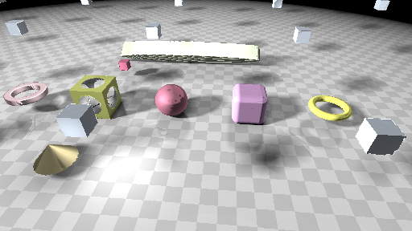
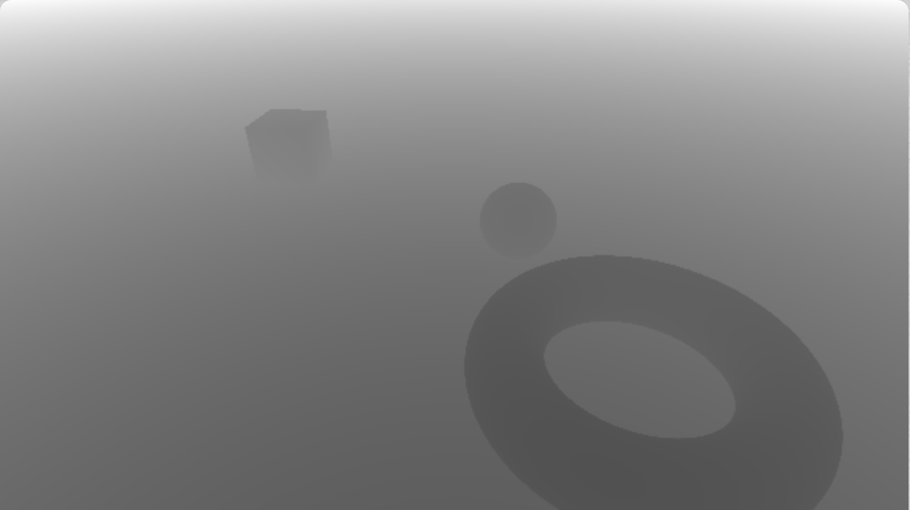

# [CIS565 2015F] Ray Marching

**GLSL Ray Marching**

**University of Pennsylvania, CIS 565: GPU Programming and Architecture, Project 5**

* Guan Sun
* Tested on: **Google Chrome 46.0.2490.71(64-bit)** on
  Mac OS X Yosemite 10.10.5, Intel Core i7 @ 2.3GHz 8GB, GeForce GT 650M 1024MB (Personal Laptop)

### Live on Shadertoy

### Acknowledgements

This Shadertoy uses material from the following resources:

* {McGuire}
  Morgan McGuire, Williams College.
  *Numerical Methods for Ray Tracing Implicitly Defined Surfaces* (2014).
  [PDF](http://graphics.cs.williams.edu/courses/cs371/f14/reading/implicit.pdf)
* {iq-prim}
  Iñigo Quílez.
  *Raymarching Primitives* (2013).
  [Shadertoy](https://www.shadertoy.com/view/Xds3zN)
* {iq-terr}
  Iñigo Quílez.
  *Terrain Raymarching* (2007).
  [Article](http://www.iquilezles.org/www/articles/terrainmarching/terrainmarching.htm)
* {iq-rwwtt}
  Iñigo Quílez.
  *Rendering Worlds with Two Triangles with raytracing on the GPU* (2008).
  [Slides](http://www.iquilezles.org/www/material/nvscene2008/rwwtt.pdf)
* {Ashima}
  Ashima Arts, Ian McEwan, Stefan Gustavson.
  *webgl-noise*.
  [GitHub](https://github.com/ashima/webgl-noise)

## Project Description:
In this project, ray marching is implemented with several other features in an online shader editor [Shadertoy](http://www.shadertoy.com/) using GLSL.
The implemented features include,
* Two ray marching methods
  * Naive ray marching (fixed step size) {McGuire 4}
  * Sphere tracing (step size varies based on signed distance field) {McGuire 6}
* 4 different distance estimators {McGuire 7} {iq-prim}
  * With normal computation {McGuire 8}
* One simple lighting computation (Lambert).
* Soft shadowing using secondary rays {iq-prim} {iq-rwwtt p55}
* Union operator {McGuire 11.1}
* Debug views
  * Distance to surface for each pixel
  * Normal direction

### Redering result

### Debug views

* Depth view

* Normal view

## Analysis
I implemented both naive ray marching and sphere tracing, the perfomance of them are,
* Naive ray marching: 23.5 FPS
* Sphere tracing: 57.3 FPS

It is clear that sphere tracing has a much better rendering perfomance, the reason is it uses a singed distance funtion to adjust the size of each step of the ray cast, thus need much fewer iterations than the naive ray marching which use a fixed step size.

