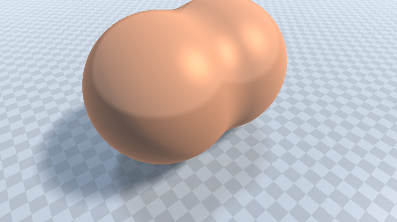
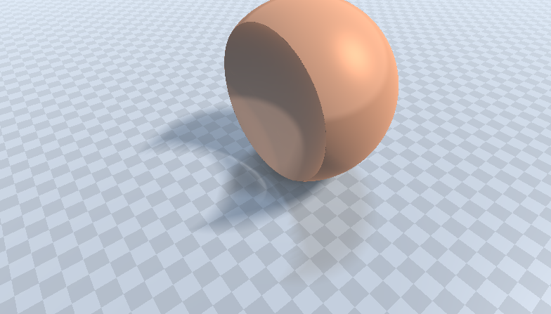

# [CIS565 2015F] WebGL Shader

**GLSL Ray Marching**

**University of Pennsylvania, CIS 565: GPU Programming and Architecture, Project 5**

* Ziye Zhou
* Tested on:  **Google Chrome 41.0.2272.89 m** on
  Windows 10, i7-4710MQ @ 2.50GHz 32GB, AMD HD8970M (Personal Laptop)

### Live on Shadertoy

#Description
###Primitive Signed Distance Function
I have implemented different kinds of primitve Signed Distance Function using the method provided in the paper *Numerical Methods for Ray Tracing Implicitly Defined Surfaces* (2014).
  [PDF](http://graphics.cs.williams.edu/courses/cs371/f14/reading/implicit.pdf)
    
    
    
    
    
    
### Operation on Primitive
In order to create more interesting object using the combination of primitives, I have implemented some operation method.

* Union

* Blend

* Intersection

* Substraction

  
### Lightning

For the lighting part, I have implemented **Blinn-Phong** shading model with ambient light. Also, I have implemented **softshadow** and specular surface using secondary rays along with **Ambient Occlusion**. 

* Ambient Occlusion Compare

with AO

w/o AO

I also implented the fog effect using the intersection time t to decay the color and mix with fog color. By tweaking the decay coefficient we can get different fog effect.

* Fog Effect Compare

No Fog

Light Fog

Heavy Fog

### Debug Views

I have implemented two different debug views, which are depth view (Distance to surface for each pixel) and iteration view (Number of ray march iterations used for each pixel)
* Reference View

* Depth View

In the Depth View, the darker the color, the deeper the depth value.
* Interation View

In the Interation View, the lighter the color, the more the interation number is.

### Ray Marching Algorithm

At first, I was using the naive ray marching algorithm, which use fixed step size in each iteration to find the intersection. This is very easy to implemented and can be used in the first place to test the correctness of the whole pipeline. But the problem with this algorithm is that it is linear to the (1/step size), which means if you want 2x more accurate measurement you need to pay 2x more time marching to rays. Then I implemented the sphere tracing algorithm to optimize the ray marching step. It is quite a lot more computation efficient comapred to the naive one. I used the iteration view to compare the iteration time for each pixel as below:
* Naive Algo

I was using 50 as the maximum interation time for the visualization. Since the naive method use more than 50 interation to compute, it shows almost all white in the scence.

* Sphere Tracing

But sphere tracing also has some redundant computation according to the   *Numerical Methods for Ray Tracing Implicitly Defined Surfaces* (2014). [PDF](http://graphics.cs.williams.edu/courses/cs371/f14/reading/implicit.pdf) Therefore I implemented the  Over-relaxation method of sphere tracing to further optimize the step. I was also using the interation view to visualize the performance. 

* Sphere Tracing W/O Over-relaxation

*Sphere Tracing W Over-relaxation (omega 1.2)

*Sphere Tracing W Over-relaxation (omega 1.6)

*Sphere Tracing W Over-relaxation (omega 2.0)

From the comparasion above, we can notice that the Sphere Tracing with Over-relaxation does not always give better performance. For the near scene (with small depth value), it acutally needs more iteration time. However for the farther scene, it shows the advantages. Also, we can notice that the different relaxation coefficient can give different result. If the coefficient is not chosen appropriately, as Sphere Tracing W Over-relaxation (omega 2.0) shows, it actually can decrease the performance.

### Height-mapped Terrain Rendering

At last, I also implemented the Height-mapped Terrain Rendering according to *Terrain Raymarching* (2007).
  [Article](http://www.iquilezles.org/www/articles/terrainmarching/terrainmarching.htm) And I got some interesting results as follows:

* Ocean

* Dessert

In order to simulate the sand effect, I added some random noise using the texture as input.

### Acknowledgements

This Shadertoy uses material from the following resources:

* {CIS 565 slides}
  [slides](http://cis565-fall-2015.github.io/lectures/12-Ray-Marching.pptx)
* {McGuire}
  Morgan McGuire, Williams College.
  *Numerical Methods for Ray Tracing Implicitly Defined Surfaces* (2014).
  [PDF](http://graphics.cs.williams.edu/courses/cs371/f14/reading/implicit.pdf)
* {iq-prim}
  Iñigo Quílez.
  *Raymarching Primitives* (2013).
  [Shadertoy](https://www.shadertoy.com/view/Xds3zN)
* {iq-terr}
  Iñigo Quílez.
  *Terrain Raymarching* (2007).
  [Article](http://www.iquilezles.org/www/articles/terrainmarching/terrainmarching.htm)
* {iq-rwwtt}
  Iñigo Quílez.
  *Rendering Worlds with Two Triangles with raytracing on the GPU* (2008).
  [Slides](http://www.iquilezles.org/www/material/nvscene2008/rwwtt.pdf)
* {Nop Jiarathanakul's BLOG}
  [Article](http://nopjia.blogspot.com/search?updated-min=2012-01-01T00:00:00-05:00&updated-max=2013-01-01T00:00:00-05:00&max-results=27)
* {G3D Innovation Engine’s g3dmath.glsl}

