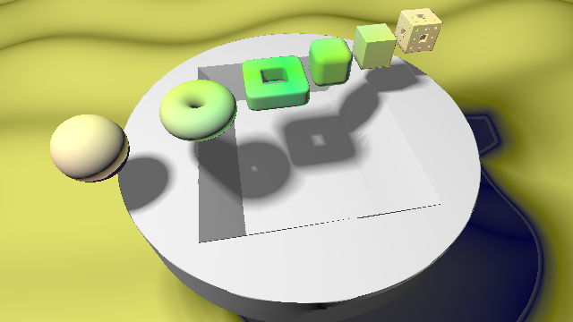
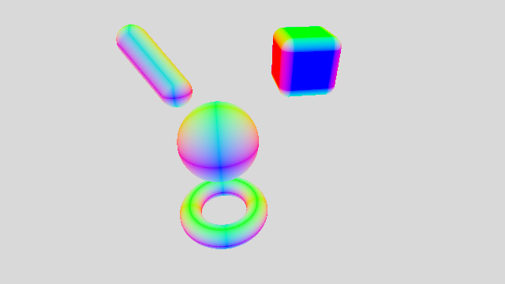

# [CIS565 2015F] YOUR TITLE HERE

**GLSL Ray Marching**

**University of Pennsylvania, CIS 565: GPU Programming and Architecture, Project 5**

* Kangning Li
* Tested on: Google Chrome 46.0.2490.71 m on Windows 10, i7-4790 @ 3.6GHz 16GB, GTX 970 4096MB

### Live on Shadertoy

### Acknowledgements

This Shadertoy uses material from the following resources:
* Morgan McGuire, Williams College.
  *Numerical Methods for Ray Tracing Implicitly Defined Surfaces* (2014).
  [PDF](http://graphics.cs.williams.edu/courses/cs371/f14/reading/implicit.pdf)
* Iñigo Quílez.
  *Raymarching Primitives* (2013).
  [Shadertoy](https://www.shadertoy.com/view/Xds3zN)
* Iñigo Quílez.
  *Terrain Raymarching* (2007).
  [Article](http://www.iquilezles.org/www/articles/terrainmarching/terrainmarching.htm)
* Iñigo Quílez.
  *Rendering Worlds with Two Triangles with raytracing on the GPU* (2008).
  [Slides](http://www.iquilezles.org/www/material/nvscene2008/rwwtt.pdf)
* Lukasz Jaroslaw Tomczak, Technical University of Denmark.
  *GPU Ray Marching of Distance Fields* (2012).
  [PDF](http://www2.compute.dtu.dk/pubdb/views/edoc_download.php/6392/pdf/imm6392.pdf)

### Overview

This shadertoy is an introductory exercise to raytracing by ray marching against signed distance functions. It features:
*support for cubes, spheres, infinite planes, height/terrain functions, and menger sponges
*transformations and union for each "primitive" type
*lambert shading with soft/hard shadows and ambient occlusion
*an option to switch between naive ray marching and spherical distance ray marching
*a handful of debugging features

### Modeling Features

#### cubes, spheres, infinite planes, and modeling transformations
These are referenced from Morgan McGuire's *Numerical Methods for Ray Tracing Implicitly Defined Surfaces*
Each potential function evaluator has been modified to take in modeling transformations along with the point whose distance is being computed. Transformations supported include translation, euler angle rotation, and non-uniform scaling.

#### height/terrain function
The height/terrain function draws from Iñigo Quílez's article *Terrain Raymarching.* At the moment it uses a sine function over the x and z coordinates of the point instead of a perlin noise function as a compact proof of concept. The same transformations are supported.

#### menger sponge
The menger sponge function iteratively computes a distance for a menger sponge to the 3rd iteration.
The same transformations are supported.

### Lighting Features

## Lambert shading

A single light is supported. Lambert shading is computationally very cheap.

#### Ambient Occlusion

Given a point that needs to be shaded, the shadertoy approximates ambient occlusion by sampling the distance function at points along the surface point's normal direction. This is heavily based on the ambient occlusion method described in Lukasz Jaroslaw Tomczak's *GPU Ray Marching of Distance Fields* and implemented in Iñigo Quílez's *Raymarching Primitives.*

#### Soft Shadows

Given a point that needs to be shaded, the shadertoy approximates soft shadows by raymarching towards the light and using the point's distance from an occluding object to "soften" the shadow. This is heavily based on the soft shadow method described in Lukasz Jaroslaw Tomczak's *GPU Ray Marching of Distance Fields* and implemented in Iñigo Quílez's *Raymarching Primitives.*

#### Spherical Ray Marching

Spherical ray marching attempts to speed up the ray marching by taking larger steps bounded by a distance function evaluation at each step. However, this can lead to unusual results with the terrain function and spheres with extreme nonuniform scale.
Based on the description in Morgan McGuire's *Numerical Methods for Ray Tracing Implicitly Defined Surfaces.*

### Debugging

This raymarcher includes numerous debugging features, all of which can be toggled from the defines at the top of the file.

#### Normals

#### Distance

Distance is similar to a depth test.

#### Steps

Steps visualizes the number of steps the ray marching method took to reach each rendered point. The scale can be modified to change the contrast.

### Analysis