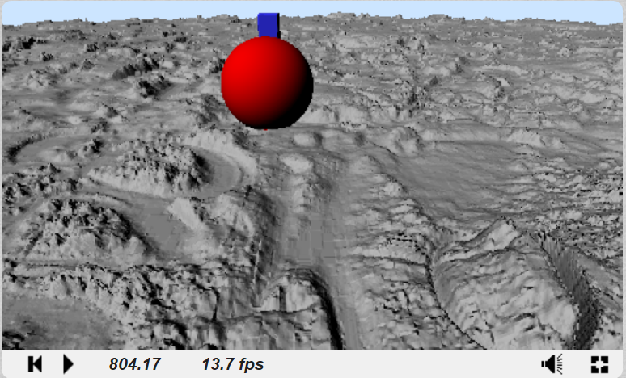

# [CIS565 2015F] YOUR TITLE HERE

**GLSL Ray Marching**

**University of Pennsylvania, CIS 565: GPU Programming and Architecture, Project 5**

* Ziwei Zong
* Tested on: (TODO) **Google Chrome 222.2** on
  Windows 10, i7-5500 @ 2.40GHz 8GB, GTX 950M (Personal)

Overview
========================

Acknolegements
========================

**Iñigo Quílez**

* Raymarching Primitives. [Shadertoy](https://www.shadertoy.com/view/Xds3zN)

* Menger Sponge.  [Shadertoy](https://www.shadertoy.com/view/4sX3Rn)

Features
========================

**Height Map**

**Merger Sponge**

**Soft Shadow

|Soft Shdow				|Sharp Shadow
|:---------------------------------:|:---------------------------------------:
|	|

**Ambient Occlusion**

|Without AO				|With AO
|:---------------------------------:|:---------------------------------------:
|	|

Analysis
========================

#### Naive Ray Marching vs. Sphere Tracing

**Test Scene**

**Iteration Number Debug View**

|Naive Ray Marching					|Sphere Tracing
|:---------------------------------:|:---------------------------------------:
|	|
| !!!!Analysis here ... ...

**Precision and FPS**

* Naive Ray Marching

|Max Iteration Numver| 1000| 1300| 2000| 4000|19000|
|--------------------|-----|-----|-----|-----|-----|
|		Precision	 |0.02 |0.015| 0.01|0.005|0.001|
|   FPS				 |   60|   52|   38|   20|  4.3|

!!!!Analysis here ... ...

* Sphere Tracing

|Max Iteration Numver|80000 |        |        |        |
|--------------------|------|--------|--------|--------|
|		Precision	 |  1e-6|  9.5e-7|  9.0e-7|  6.0e-7|
|   FPS				 |    60|    12.5|       7|     6.8|

!!!!Analysis here ... ...

#### XXX

References
========================
